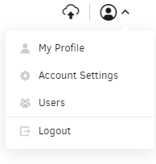
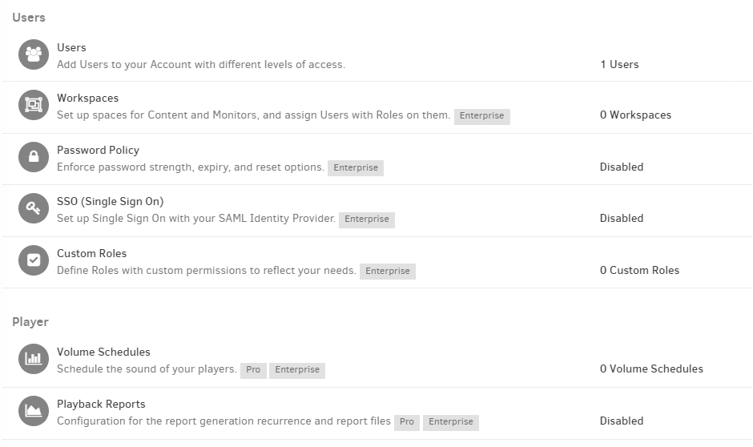
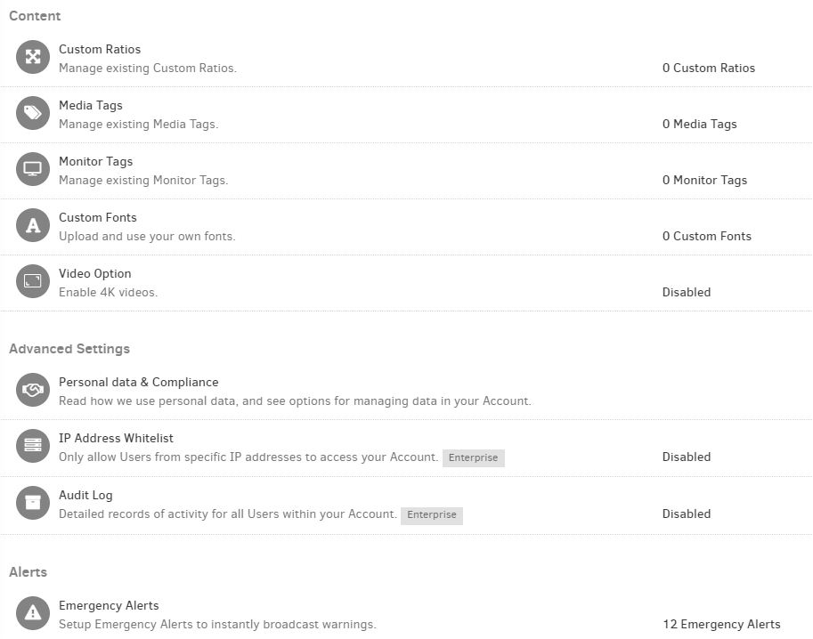

# 11. Paramètres du compte

Dans cette section, vous pouvez modifier tous les paramètres par défaut que vous souhaitez et personnaliser entièrement votre compte. Vous pouvez accéder rapidement à votre compte en suivant ce lien ou en cliquant sur le bouton Paramètres du compte situé dans le coin supérieur droit de votre navigateur.

### Liste complète des paramètres d'accès

Ci-dessous, vous pouvez voir une liste complète des options de paramètres du compte.

