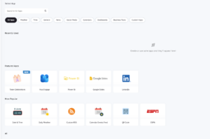
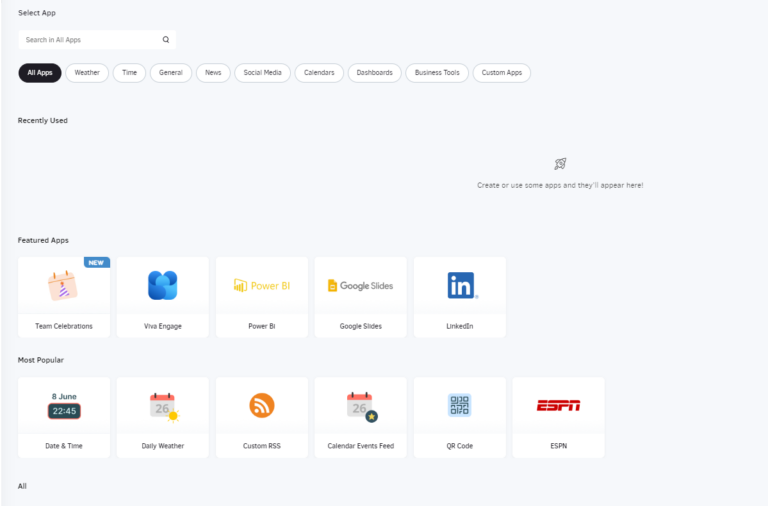

# 5. Applications

Les applications sont de petites applications qui affichent des informations utiles comme un Ticker (flux RSS ou texte défilant), du texte enrichi (texte statique), l'affichage de la météo, une horloge, etc. Cette section peut ajouter une application de notre collection existante ou créer et télécharger votre application.

### Créer une application

Pour créer une application, cliquez sur le bouton vert ”**Créer une application**” en bas de la liste des applications. Ensuite, vous pouvez choisir entre des applications standard, des tableaux de bord, des applications sociales ou des applications personnalisées. Veuillez consulter les sections correspondantes à gauche de notre documentation pour plus d'informations.

Plongez dans notre galerie d'applications améliorée spécialement conçue pour vous :
*   **Récemment utilisées**: Voir vos applications récemment utilisées sous ‘Récemment utilisées’.
*   **En vedette**: Explorez les applications tendance de la plateforme.
*   **Les plus populaires**: Découvrez les applications leaders de votre secteur.
*   **Nouveau**: Repérez nos applications fraîchement publiées marquées d'une puce ‘Nouveau’.
*   **Filtres et recherche**: Découvrez notre catégorisation et notre capacité de recherche améliorées, optimisées pour une navigation fluide.

### Catégories d'applications

1.  **Météo**: Météo horaire, Météo actuelle, Météo quotidienne, Alertes météorologiques nationales
2.  **Temps**: Compteur montant/descendant, Date et heure, Horloge analogique, Horloge mondiale
3.  **Général**: Ticker, Notification d'anniversaire, Google Slides, Informations de base sur le lecteur, Diaporama en ligne, WikiQuotes, Partage WiFi, DSMenu, Code QR, Widget d'intégration, Trafic Google, PosterMyWall, Texte enrichi, Source TV
4.  **Nouvelles**: AlJazeera, CNN, ESPN, Alertes Google, RSS personnalisé, BBC, Google News, Fox News, CBC News, New York Times, The Guardian, CTV, Wall Street Journal, Yahoo!, Sky News
5.  **Réseaux sociaux**: Flux utilisateur Facebook, Flux de page Facebook, Walls.io, Twitter, Taggbox Display, Widget de profil Instagram, LinkedIn
6.  **Calendriers**: Calendrier mensuel, Flux d'événements de calendrier, Calendrier quotidien/hebdomadaire, Google Calendar, Outlook Calendar
7.  **Tableaux de bord**: Asana, Baremetrics, Chargebee, Chartmogul, Cumul.io, Cyfe, Fathom, Google Analytics, Google Looker Studio, Grafana, Power Bi, Putler, Shedul, Tableau, Tableau (JWT), Trello, Trello avec connexion Attlasian, Xero, Zenkit, Zoho
8.  **Outils professionnels**: Zoom Rooms, Canva, Canal Teams, Viva Engage, Sharepoint, Qube
9.  **Applications personnalisées**: Créer une application HTML, Créer une application Web

### Gestion des applications

Dans la section “Applications”, vous pouvez voir une liste des applications actuellement créées dans votre compte. Les informations sur les applications sont organisées dans les colonnes suivantes :
*   Le **Nom** de l'application, ainsi qu'un **Aperçu** (vignette)
*   Le **Horodatage** (date et heure) de la dernière modification de l'application
*   Le **Workspace** (pour les comptes du plan **Enterprise**) auquel appartient l'application
*   la colonne **Actions**

Si vous cliquez sur l'icône à trois points dans la colonne Actions, vous verrez une liste d'actions à appliquer à vos applications.

Cliquez sur chaque onglet ci-dessous pour voir une brève description.

Modifier Dupliquer Déplacer Supprimer
Changez les détails d'une **application en cliquant sur le bouton ”Modifier”**.
**  
Ici, vous pouvez remplacer l'application réelle, qui sera modifiée partout où elle est utilisée.**
**  
Consultez la section “Créer une application” pour plus de détails**.
Créez une copie exacte de l'application avec un nouveau nom.
Vous pouvez déplacer des applications vers des dossiers et/ou d'autres Workspaces (pour les comptes du plan **Enterprise**).
Supprimez l'application.

### Paramètres de contrôle supplémentaires

La boîte de recherche en haut à gauche vous permet de trier rapidement votre liste d'applications. Vous pouvez rechercher en utilisant l'une des quatre colonnes : nom, date, workspace et tag.
Vous pouvez sélectionner une ou plusieurs applications en cliquant sur la case carrée à gauche de leur vignette. Vous pouvez ensuite cliquer sur le bouton **Actions** en bas pour modifier, déplacer et supprimer toutes les applications sélectionnées à la fois.
En haut à droite, vous pouvez cliquer sur le bouton “**+Ajouter un dossier**” pour créer un dossier pour regrouper les fichiers multimédias (le dossier sera global et inclura des images, des vidéos, de l'audio, des documents, des pages Web et des applications).
Vous pouvez également modifier la liste et actualiser la vue.

