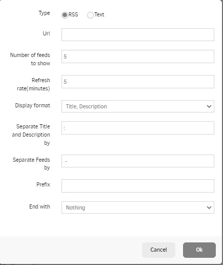

# Ticker

## Table des matières
- [Créer une application Ticker](#créer-une-application-ticker)
- [Comment créer un Ticker RSS](#comment-créer-un-ticker-rss)

Vous pouvez ajouter du texte RSS ou statique. Le texte défilera de droite à gauche. Cela vous permet de personnaliser votre texte défilant de différentes manières.

## Créer une application Ticker
Cliquez sur l'application Ticker dans votre galerie d'applications pour l'ajouter pour créer rapidement une nouvelle application et remplir les détails de l'application comme suit :
1.  Un **Nom** est requis pour l'application et une **Description** optionnelle pour celle-ci.
2.  Définissez la **Durée par défaut** pour que l'application apparaisse dans une playlist.
3.  Choisissez la **Vitesse** (Durée de bord à bord en secondes. Plus grand est plus lent) de votre texte défilant.
4.  Définissez le **Style** de votre texte en cliquant sur les différentes options disponibles.
5.  Tapez le **Texte à afficher** que vous souhaitez afficher. Vous pouvez ajouter plusieurs entrées en cliquant sur **Ajouter un flux**.
6.  Vous pouvez définir les paramètres **Jouer à partir de**/**Jouer jusqu'à**. En d'autres termes, vous pouvez sélectionner la date d'expiration, ce qui signifie que vous pouvez choisir la date et l'heure exactes auxquelles cette application sera lue dans votre playlist. Nous **recommandons** de sélectionner les paramètres “Toujours” et “Pour toujours” pour que l'application n'expire jamais.

## Comment créer un Ticker RSS
Pour créer un Ticker RSS, suivez les étapes 1 à 4 de la procédure ci-dessus.  
À l'étape 5, en cliquant sur le bouton **Ajouter un flux**, une nouvelle fenêtre apparaît. Dans cette fenêtre, et plus précisément dans le **Type de flux**, sélectionnez l'option RSS.  
Une nouvelle fenêtre apparaîtra à nouveau avec tous les paramètres requis. Personnalisez votre flux RSS selon vos besoins.
Après avoir personnalisé votre Ticker RSS, cliquez sur le bouton **Ok**, puis sur le bouton **Enregistrer** pour terminer la configuration de l'application.

