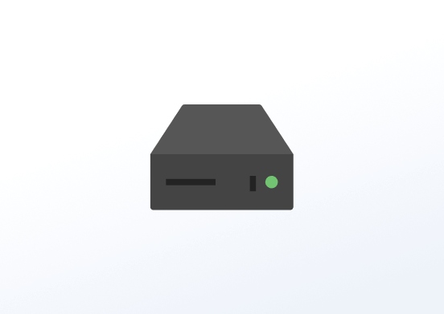

# Informations de base sur le lecteur

## Table des matières
- [Créer une application Informations de base sur le lecteur](#créer-une-application-informations-de-base-sur-le-lecteur)
- [Exemple d'informations de base sur le lecteur](#exemple-dinformations-de-base-sur-le-lecteur)

Affichez les informations de base de votre lecteur sur l'écran de télévision. Il s'agit d'une application simple qui affiche les informations de votre lecteur (Nom, ID et Emplacement) sur votre écran de télévision.

## Créer une application Informations de base sur le lecteur
Cliquez sur l'application Informations de base sur le lecteur dans votre galerie d'applications pour l'ajouter et remplir les détails de l'application comme suit :
1.  Un **Nom** est requis pour l'application et une **Description** optionnelle.
2.  Activez ou désactivez l'affichage du nom si vous souhaitez que l'application affiche le nom de l'écran.
3.  Activez ou désactivez l'affichage de l'ID si vous souhaitez que l'application affiche l'ID de l'écran.
4.  Activez ou désactivez l'affichage de l'emplacement si vous souhaitez que l'application affiche l'emplacement du lecteur.
5.  Configurez les paramètres de style en sélectionnant la police, la couleur de l'arrière-plan et la couleur du texte.
6.  Définissez la Durée par défaut pendant laquelle l'application apparaîtra dans une playlist.
7.  Vous pouvez définir les paramètres Jouer à partir de/Jouer jusqu'à. En d'autres termes, vous pouvez sélectionner la date d'expiration, ce qui signifie que vous pouvez choisir la date et l'heure exactes auxquelles cette application sera lue dans votre playlist. Nous recommandons de sélectionner les paramètres “Toujours” et “Pour toujours” pour que l'application n'expire jamais.
8.  Cliquez sur Enregistrer, et votre application est prête à être utilisée.

## Exemple d'informations de base sur le lecteur

