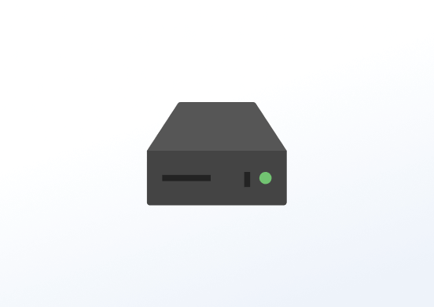

# Partage WiFi

## Table des matières
- [Créer une application Partage WiFi](#créer-une-application-partage-wifi)
- [Exemple d'application Partage WiFi](#exemple-dapplication-partage-wifi)

Partagez votre WiFi avec vos clients. Créez un code QR pour partager votre réseau WiFi avec d'autres! Vous pouvez également inclure le nom et le mot de passe de votre WiFi.

## Créer une application Partage WiFi
Cliquez sur l'application Partage WiFi dans votre galerie d'applications pour l'ajouter et remplir les détails de l'application comme suit :
1.  Un **Nom** est requis pour l'application et une **Description** optionnelle pour celle-ci.
2.  Sélectionnez le **type de WiFi** dans la liste déroulante.
3.  Tapez le **Nom du réseau WiFi** (il est sensible à la casse).
4.  Tapez votre **Mot de passe WiFi** (il est sensible à la casse).
5.  Activez l'option **Afficher le nom et le mot de passe du réseau** si vous souhaitez afficher le nom et le mot de passe sous le code QR.
6.  Tapez un **Titre**.
7.  Sélectionnez la couleur de l'**Arrière-plan** et du **Texte** de l'application.
8.  Définissez la **Durée par défaut** pendant laquelle l'application apparaîtra dans une playlist.
9.  Vous pouvez définir les paramètres **Jouer à partir de**/**Jouer jusqu'à**. En d'autres termes, vous pouvez sélectionner la date d'expiration, ce qui signifie que vous pouvez choisir la date et l'heure exactes auxquelles cette application sera lue dans votre playlist. Nous **recommandons** de sélectionner les paramètres “Toujours” et “Pour toujours” pour que l'application n'expire jamais.
10.  Cliquez sur **Enregistrer** et votre application est prête à être utilisée.

## Exemple d'application Partage WiFi

