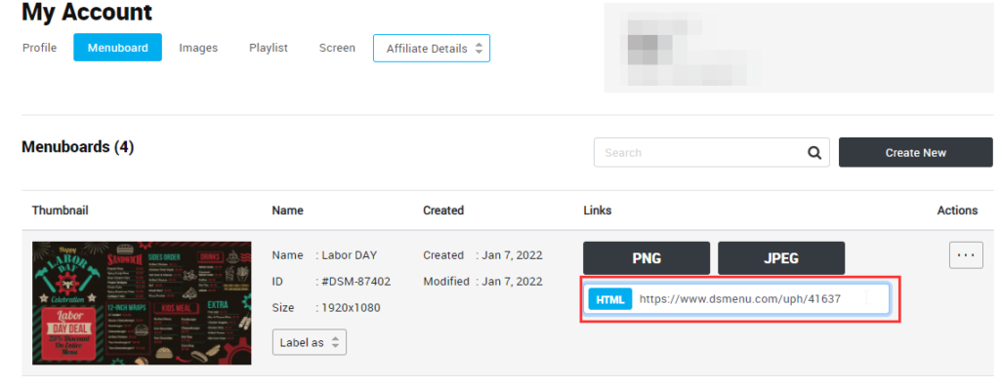
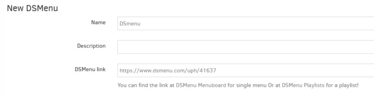

# DSMenu

## Table des matières
- [Créer une application DSMenu](#créer-une-application-dsmenu)
- [Obtenir le lien DSMenu](#obtenir-le-lien-dsmenu)
- [Configuration finale de DSMenu](#configuration-finale-de-dsmenu)

DSMenu est une application de conception de tableaux de menus numériques pour créer des tableaux de menus numériques sur une plateforme facile à utiliser et rentable sans matériel supplémentaire. Les modèles facilitent la conception pour les petites entreprises, les équipes sportives, les promotions de détail, les concerts, les événements, les cadeaux, et bien plus encore.

## Créer une application DSMenu
Cliquez sur l'application DSMenu dans votre galerie d'applications pour l'ajouter, et remplissez les détails de l'application comme suit :
1. Un **Nom** est requis pour l'application et une **Description** optionnelle pour celle-ci.
2. Collez le lien DSMenu. 💡**_Consultez la section ci-dessous pour savoir comment faire._**
3. Définissez la **Durée par défaut** pendant laquelle l'application apparaîtra dans une playlist.
4. Vous pouvez définir les paramètres **Lire de**/**Lire jusqu'à**. En d'autres termes, vous pouvez sélectionner la date d'expiration, ce qui signifie que vous pouvez choisir la date et l'heure exactes auxquelles cette application sera lue dans votre playlist. Nous recommandons de sélectionner les paramètres "Toujours" et "Pour toujours" pour que l'application n'expire jamais.
5. Cliquez sur "**Enregistrer**", et votre application est prête à être utilisée.

## Obtenir le lien DSMenu
Étape par étape
1. Suivez **[ce lien](https://www.dsmenu.com/index)** pour créer un compte DSMenu, choisir et commencer à éditer vos nouveaux modèles.
2. Une fois votre modèle finalisé, **enregistrez-le** et **publiez-le**.
3. Ensuite, suivez **[ce lien](https://www.dsmenu.com/my-menuboard)** pour accéder à votre tableau de menus DSMenu et obtenir le lien DSMenu. Ou sur **[DSMenu Playlists](https://www.dsmenu.com/my-playlist)** pour une playlist.
4. Copiez ce lien et collez-le dans l'application DSMenu.

## Configuration finale de DSMenu

