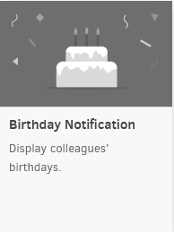
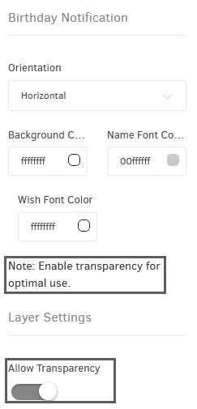

# Notification d'anniversaire

Rien n'est plus réconfortant que de recevoir un souhait d'anniversaire de quelqu'un d'inattendu. Notre nouvelle application permet à vos membres d'équipe de se sentir tout aussi valorisés le jour de leur anniversaire.

## Créer une application de notification d'anniversaire
Cliquez sur l'application Anniversaire dans votre galerie d'applications pour l'ajouter, et remplissez les détails de l'application comme suit :
1. Un **Nom** est requis pour l'application et une **Description** optionnelle pour celle-ci.
2. Tapez votre **Souhait** !
3. Importez les dates au format CSV.
    * 💡Consultez le paragraphe suivant _(Format CSV)_ pour plus de détails.
4. Choisissez le format de date du CSV, l'orientation de votre application d'anniversaire, les couleurs de police, les couleurs de fond, etc.
5. Définissez une URL d'image par défaut
    * 💡Comme cette [image ici](https://media.istockphoto.com/photos/indian-summer-river-landscape-picture-id1180478052?k=20&m=1180478052&s=612x612&w=0&h=hFFUq_9-ScrdCtHdktqPMR9JdnoRr3QBNGcAo6QavZI=).
6. Définissez la **Durée par défaut** pour que l'application apparaisse dans une playlist.
7. Vous pouvez définir les paramètres **Lire de / Lire jusqu'à**. En d'autres termes, vous pouvez sélectionner la date d'expiration, ce qui signifie que vous pouvez choisir la date et l'heure exactes auxquelles cette application sera lue dans votre playlist. Nous recommandons de sélectionner les paramètres "Toujours" et "Pour toujours" pour que l'application n'expire jamais.
8. Cliquez sur "Enregistrer", et votre application est prête à être utilisée. Assignez-la à votre écran, et le lecteur affichera le graphique relatif.

## Format CSV
Vous pouvez créer un **fichier texte** et **l'enregistrer** au format CSV dans le format suivant :
* 1986-12-25,John Doe
* 1957-02-15,Jane Doe
Sinon, à partir d'un fichier Excel ayant dans la 1ère colonne les dates de naissance et dans la 2ème colonne les noms, exportez-le au format CSV.
Comme l'application n'apparaît que les jours où un anniversaire est affiché, vous pouvez la tester en ajoutant une fausse date de naissance au jour actuel.

> Permettre **la transparence**
> 
> Si vous avez des dates futures dans votre CSV et que vous avez placé l'application dans votre mise en page, activez l'option de transparence. L'application se cachera jusqu'à ce qu'un jour futur arrive. Lorsque cela se produit, l'application apparaîtra sur l'écran de télévision avec le message d'anniversaire relatif.

## Résultat final

## FAQ
### J'ai mis à jour la photo à afficher lorsque nous n'avons pas d'anniversaires, et elle n'est pas affichée.
**R:** Vous devez utiliser une URL qui contient le nom de fichier et le type de l'image.
### Y a-t-il une limitation sur le format d'image pour les lecteurs alternatifs ?
**R:** Les images au format SVG ne peuvent pas être affichées sur les lecteurs FireOS.
