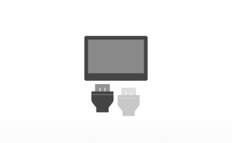
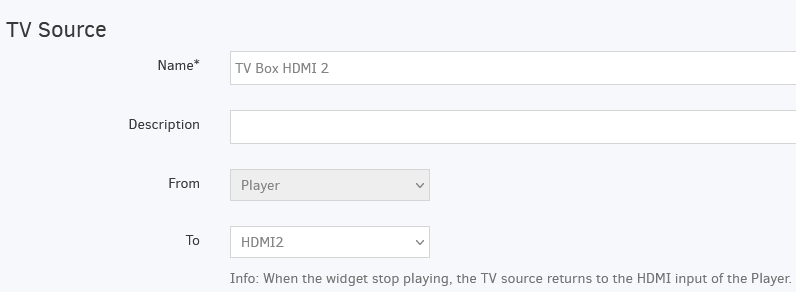

# Source TV

## Introduction
Cette application peut être utilisée **uniquement** pour les lecteurs basés sur Raspberry Pi. Pour les autres types de lecteurs, cette application n'aura aucune utilité.
Changez la source TV de votre lecteur multimédia vers une autre entrée HDMI. Similaire au changement de source depuis votre télécommande TV. Cas d'utilisation typique : Changer le contenu entre la télévision en direct du décodeur et le contenu de signalisation numérique.
⚠️ **Cela fonctionne uniquement avec un lecteur basé sur Raspberry Pi.**

## Créer une application de source TV
Cliquez sur l'application de source TV dans votre galerie d'applications pour l'ajouter et remplissez les détails de l'application comme suit :
1. Un **Nom** est requis pour l'application et une **Description** optionnelle.
2. Sélectionnez la source HDMI vers laquelle vous souhaitez que l'écran TV bascule.
3. Cliquez sur **Enregistrer**, et votre application est prête à être utilisée.

> _Changement de source HDMI_
> 
> Lorsque l'application cesse de jouer, la source TV revient à l'entrée HDMI du lecteur. Par exemple, si vous avez programmé l'application pour jouer de 10h à 11h, la TV reviendra à la source HDMI du lecteur.

## Paramètres avancés
- Définissez la **Durée par défaut** pendant laquelle l'application apparaîtra dans une playlist.
- Vous pouvez définir les paramètres **Lire de / Lire jusqu'à**. En d'autres termes, vous pouvez sélectionner la date d'expiration, ce qui signifie que vous pouvez choisir la date et l'heure exactes auxquelles cette application sera lue dans votre playlist. Nous recommandons de sélectionner les paramètres "Toujours" et "Pour toujours" pour que l'application n'expire jamais.

## Exemple
Vous souhaitez afficher un match de football ou un film pendant une période spécifique. Vous pouvez programmer ce changement en créant l'application de source TV et en la programmant pour changer la source HDMI vers la source où un décodeur TV est connecté à l'écran TV. Avec cette fonctionnalité, le lecteur ajustera automatiquement la source TV à celle que vous avez configurée dans l'application de source TV.
J'ai configuré un décodeur TV sur mon écran TV en HDMI2. Je vais créer une application de source TV avec la configuration ci-dessous. Ensuite, je programmerai cette application pour jouer de 10h à 12h. Pendant cette période, l'application forcera le lecteur à basculer vers HDMI 2 pendant 2 heures. Après cela, le HDMI reviendra à la source HDMI du lecteur.

## Compatibilité CEC
Le lecteur _(ou Raspberry Pi en général)_ inclut un adaptateur CEC sur son port HDMI. CEC est un protocole de communication standard pris en charge par la plupart des grands fabricants de téléviseurs. Il permet à un appareil de lecture (Playbox) de s'allumer et de s'éteindre et de changer les entrées vidéo sur un téléviseur compatible CEC. Consultez le **[tableau de compatibilité CEC](http://libcec.pulse-eight.com/Vendor/Support)**. Si votre moniteur/écran ne prend pas en charge le CEC (par exemple, vous avez un moniteur d'ordinateur), le lecteur Raspberry éteint le port HDMI pour lui permettre de s'éteindre. Cette fonction est prise en charge par tous les moniteurs d'ordinateur actuels, même certains téléviseurs. Le CEC n'est **pas** pris en charge si vous utilisez un PC comme lecteur.
Le logiciel tentera d'éteindre ou de changer le port HDMI/VGA, mais votre matériel pourrait ne pas le prendre en charge. Il en va de même si vous utilisez un adaptateur HDMI vers VGA sur votre Playbox. À l'avenir, nous prendrons en charge l'utilisation de LED infrarouges pour signaler au moniteur de s'allumer ou de s'éteindre via IR, comme le font les télécommandes TV normales. Nous pouvons prendre en charge des solutions personnalisées pour les grandes installations, comme ci-dessus, ou utiliser des connexions série personnalisées aux moniteurs. Nous fournirons également des crochets de programmation qui vous permettront de créer des scripts personnalisés pour allumer/éteindre votre moniteur.

### Liste des spécifications CEC des fabricants
- Anynet+ ([Samsung](https://en.wikipedia.org/wiki/Samsung))
- Aquos Link ([Sharp](https://en.wikipedia.org/wiki/Sharp_Corporation))
- BRAVIA Link et BRAVIA Sync ([Sony](https://en.wikipedia.org/wiki/Sony))
- HDMI-CEC ([Hitachi](https://en.wikipedia.org/wiki/Hitachi_Ltd.))
- E-link ([AOC](https://en.wikipedia.org/wiki/AOC_International))
- Kuro Link ([Pioneer](https://en.wikipedia.org/wiki/Pioneer_(company)))
- INlink ([Insignia](https://en.wikipedia.org/wiki/Insignia))
- CE-Link et Regza Link ([Toshiba](https://en.wikipedia.org/wiki/Toshiba))
- RIHD (Remote Interactive over HDMI) ([Onkyo](https://en.wikipedia.org/wiki/Onkyo))
- RuncoLink ([Runco International](https://en.wikipedia.org/wiki/Runco_International))
- SimpLink ([LG](https://en.wikipedia.org/wiki/LG_Electronics))
- T-Link ([ITT](https://en.wikipedia.org/wiki/ITT_Corporation))
- HDAVI Control
- EZ-Sync
- VIERA Link ([Panasonic](https://en.wikipedia.org/wiki/Panasonic))
- EasyLink ([Philips](https://en.wikipedia.org/wiki/Philips))
- NetCommand for HDMI ([Mitsubishi](https://en.wikipedia.org/wiki/Mitsubishi)).

