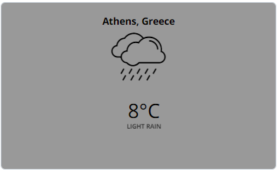

# Météo actuelle

## Table des matières
- [Créer une application Météo actuelle](#créer-une-application-météo-actuelle)
- [Exemple d'application Météo actuelle](#exemple-dapplication-météo-actuelle)

Affichez les informations météorologiques actuelles d'OpenWeather. L'application rechargera automatiquement les données toutes les 10 minutes.

## Créer une application Météo actuelle
Cliquez sur l'application Météo actuelle dans votre galerie d'applications pour l'ajouter, pour créer rapidement une nouvelle application et remplir les détails de l'application comme suit :
1.  Un **Nom** est requis pour l'application, et une **Description** optionnelle pour celle-ci.
2.  Choisissez d'utiliser l'emplacement physique du lecteur ou désactivez-le et choisissez un emplacement sur la carte.
3.  Tapez un en-tête de localisation pour votre application météo.
4.  Sélectionnez les unités de température (Celsius, Fahrenheit ou Kelvin).
5.  Choisissez la langue dans la liste déroulante.
6.  Définissez la couleur principale, la couleur du texte et la police.
7.  Définissez la **Durée par défaut** pour que l'application apparaisse dans une playlist.
8.  Vous pouvez définir les paramètres **Jouer à partir de**/**Jouer jusqu'à**. En d'autres termes, vous pouvez sélectionner la date d'expiration, ce qui signifie que vous pouvez choisir la date et l'heure exactes auxquelles cette application sera lue dans votre playlist. Nous **recommandons** de sélectionner les paramètres “Toujours” et “Pour toujours” pour que l'application n'expire jamais.
9.  Cliquez sur **Enregistrer**, et votre application est prête à être utilisée.

## Exemple d'application Météo actuelle

