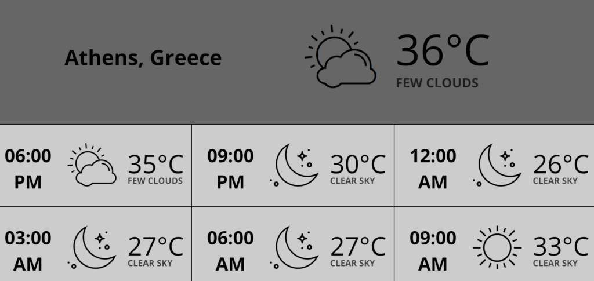

# Météo horaire

## Table des matières
- [Créer une application Météo horaire](#créer-une-application-météo-horaire)
- [Exemple d'application Météo horaire](#exemple-dapplication-météo-horaire)
- [FAQ](#faq)
    - [L'emplacement sur l'écran n'est pas correct](#h-lemplacement-sur-lécran-nest-pas-correct)
    - [Comment puis-je changer la température de Celsius à Fahrenheit?](#h-comment-puis-je-changer-la-température-de-celsius-à-fahrenheit)
    - [J'ai mis à jour le format de la température, mais l'écran n'affiche pas la température correcte.](#h-jai-mis-à-jour-le-format-de-la-température-mais-lécran-naffiche-pas-la-température-correcte)

Affichez les prévisions météorologiques par tranches de trois ou six heures en utilisant les données d'OpenWeather. L'application rechargera automatiquement les données toutes les 10 minutes.

## Créer une application Météo horaire
Cliquez sur l'application Météo horaire dans votre galerie d'applications pour l'ajouter, pour créer rapidement une nouvelle application et remplir les détails de l'application comme suit :
1.  Un **nom et une description optionnelle sont requis pour l'application**.
2.  Choisissez d'utiliser l'**emplacement physique du lecteur** ou désactivez-le et choisissez un emplacement sur la carte.
3.  Tapez un **En-tête de localisation** pour votre application météo.
4.  Sélectionnez le nombre d'**Heures de prévision**.
5.  Sélectionnez les unités de **Température** (Celsius, Fahrenheit ou Kelvin).
6.  Sélectionnez le **format de l'heure, qui doit être entre 12 et 24 heures**.
7.  Choisissez la **Langue** dans la liste déroulante.
8.  Définissez le **Thème de couleur**.
9.  Définissez la **Police** à utiliser.
10.  Définissez la **Durée par défaut** pour que l'application apparaisse dans une playlist.
11.  Vous pouvez définir les paramètres **Jouer à partir de**/**Jouer jusqu'à**. En d'autres termes, vous pouvez sélectionner la date d'expiration et choisir la date et l'heure exactes auxquelles cette application sera lue dans votre playlist. Nous recommandons de sélectionner les paramètres “Toujours” et “Pour toujours” pour que l'application n'expire jamais.
12.  Cliquez sur **Enregistrer**, et votre application est prête à être utilisée.

## Exemple d'application Météo horaire

## FAQ
#### **L'emplacement sur l'écran n'est pas correct**
**R:** Si la détection automatique de l'emplacement ne correspond pas à l'emplacement exact, désactivez la détection automatique et définissez manuellement votre emplacement dans les paramètres de l'application.
#### **Comment puis-je changer la température de Celsius à Fahrenheit?**
**R:** Vous pouvez changer la température dans les paramètres de l'application.
#### **J'ai mis à jour le format de la température, mais l'écran n'affiche pas la température correcte.**
**R**: Appuyez sur le bouton Push to Screens après chaque modification apportée à votre compte.

