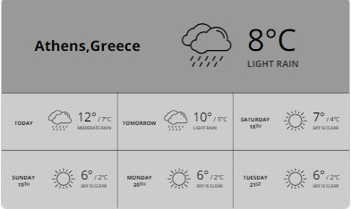

# Météo quotidienne

## Table des matières
- [Créer une application Météo quotidienne](#créer-une-application-météo-quotidienne)
- [Exemple d'application Météo quotidienne](#exemple-dapplication-météo-quotidienne)

Affichez la météo actuelle suivie des prévisions météorologiques de la semaine en utilisant les données d'OpenWeather. L'application rechargera automatiquement les données toutes les 10 minutes.

## Créer une application Météo quotidienne
Cliquez sur l'application Météo quotidienne dans votre galerie d'applications pour l'ajouter, pour créer rapidement une nouvelle application et remplir les détails de l'application comme suit :
1.  Un **Nom** est requis pour l'application et une **Description** optionnelle pour celle-ci.
2.  Choisissez d'utiliser l'**emplacement physique du lecteur** ou désactivez-le et choisissez un emplacement sur la carte.
3.  Tapez un **En-tête de localisation** pour votre application météo.
4.  Sélectionnez le nombre de **Jours de prévision**.
5.  Sélectionnez les unités de **Température** (Celsius, Fahrenheit ou Kelvin).
6.  Choisissez la **Langue** dans la liste déroulante.
7.  Définissez le **Thème de couleur**.
8.  Définissez la **Police** à utiliser.
9.  Définissez la **Durée par défaut** pour que l'application apparaisse dans une playlist.
10.  Vous pouvez définir les paramètres **Jouer à partir de**/**Jouer jusqu'à**. En d'autres termes, vous pouvez sélectionner la date d'expiration, ce qui signifie que vous pouvez choisir la date et l'heure exactes auxquelles cette application sera lue dans votre playlist. Nous **recommandons** de sélectionner les paramètres “Toujours” et “Pour toujours” pour que l'application n'expire jamais.
11.  Cliquez sur **Enregistrer**, et votre application est prête à être utilisée.

## Exemple d'application Météo quotidienne

