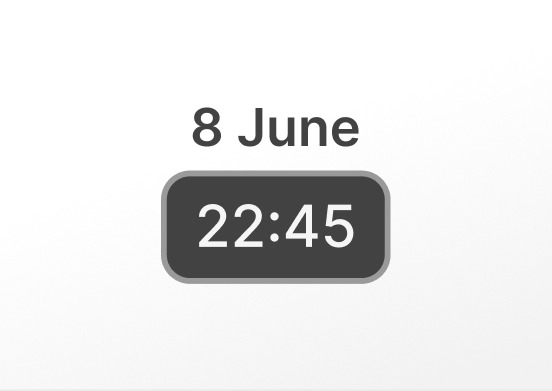
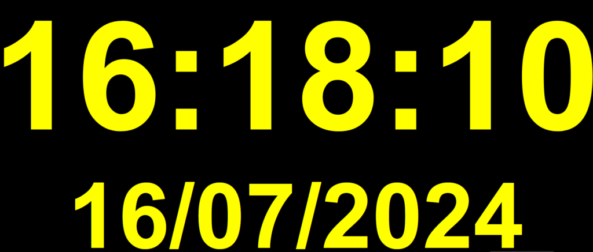

# Date et heure

## Table des matières
- [Créer une application Date et heure](#créer-une-application-date-et-heure)
- [Résultat de Date et heure](#résultat-de-date-et-heure)
- [FAQ](#h-faq)
    - [L'heure sur l'écran n'est pas correcte.](#h-lheure-sur-lécran-nest-pas-correcte)

Une horloge numérique qui affiche la date et l'heure en fonction de l'emplacement du lecteur. Vous pouvez choisir les couleurs des chiffres et de l'arrière-plan pour plus de personnalisation. La taille est automatiquement ajustée à la zone de mise en page.

## Créer une application Date et heure
Cliquez sur l'application Date et heure dans votre galerie d'applications pour l'ajouter et créer une nouvelle application et remplir les détails de l'application comme suit :
1.  Un **Nom** est requis pour l'application et une **Description** optionnelle pour celle-ci.
2.  Sélectionnez le **Format de l'heure**.
3.  Sélectionnez éventuellement un **Fuseau horaire**. Si vous n'en sélectionnez pas, l'application utilisera le fuseau horaire du lecteur auquel vous l'assignerez.
4.  Masquez ou non les **Secondes**, **Heure** et **Date**.
5.  Sélectionnez un **Format de date** dans la liste déroulante.
6.  Sélectionnez une **Langue** dans la liste déroulante.
7.  Sélectionnez la couleur de l'**Arrière-plan** et de la **Police**.
8.  Finalisez votre configuration en sélectionnant la **Famille de polices**, le **Style** et le **Type**.
9.  Définissez la **Durée par défaut** pendant laquelle l'application apparaîtra dans une playlist.
10.  Vous pouvez définir les paramètres **Jouer à partir de**/**Jouer jusqu'à**. En d'autres termes, vous pouvez sélectionner la date d'expiration, ce qui signifie que vous pouvez choisir la date et l'heure exactes auxquelles cette application sera lue dans votre playlist. Nous **recommandons** de sélectionner les paramètres “Toujours” et “Pour toujours” pour que l'application n'expire jamais.

## Résultat de Date et heure
Voici comment votre application Date et heure s'affichera sur votre écran de télévision.

## FAQ
### **L'heure sur l'écran n'est pas correcte**.
**R:** Veuillez vous connecter à votre compte et vérifier le fuseau horaire dans vos paramètres personnels et les paramètres de base des lecteurs. Si nécessaire, modifiez-le, enregistrez le formulaire et poussez les modifications vers les lecteurs.

