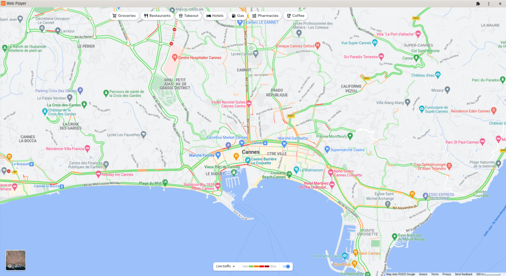

# Application de trafic Google

## Table des matières
- [Créer une application de trafic Google](#créer-une-application-de-trafic-google)
- [Comment obtenir les coordonnées de latitude et de longitude](#comment-obtenir-les-coordonnées-de-latitude-et-de-longitude)
- [Exemple d'application de trafic Google](#exemple-dapplication-de-trafic-google)

Ajoutez une carte de trafic de Google Maps à vos écrans.

## Créer une application de trafic Google
Cliquez sur l'application de trafic Google dans votre galerie de widgets pour l'ajouter et remplissez les détails du widget comme suit :
1. Un **Nom** est requis pour le widget et une **Description** optionnelle pour celui-ci.
2. Collez les coordonnées de **Latitude** et de **Longitude** telles qu'elles apparaissent dans la barre d'adresse de votre navigateur. Consultez la section suivante pour savoir comment obtenir les coordonnées.
3. Définissez le niveau de **Zoom**.
4. Facultativement, sélectionnez une **Image de secours** à afficher si la page web ne se charge pas.
5. Définissez la **Durée par défaut** pendant laquelle le widget apparaîtra dans une playlist.
6. Vous pouvez définir les paramètres **Lire de / Lire jusqu'à**. En d'autres termes, vous pouvez sélectionner la date d'expiration, ce qui signifie que vous pouvez choisir la date et l'heure exactes auxquelles ce widget sera lu dans votre playlist. Nous **recommandons** de sélectionner les paramètres "Toujours" et "Pour toujours" pour que le widget n'expire jamais.

## Comment obtenir les coordonnées de latitude et de longitude
Visitez cette page **https://google.com/maps** avec votre navigateur et naviguez jusqu'à l'endroit souhaité. Vérifiez l'adresse URL dans la barre d'adresse de votre navigateur. Le premier numéro est la **Latitude**, le second est la **Longitude** et le troisième est le niveau de **Zoom** que vous utilisez actuellement.

## Exemple d'application de trafic Google

