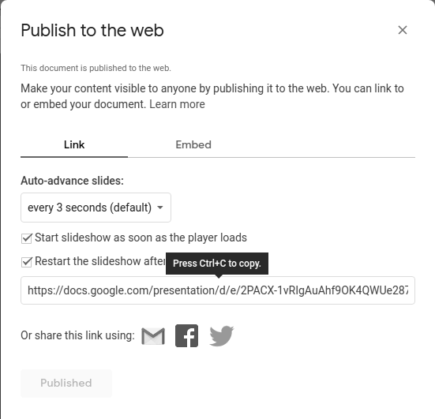

# Google Slides

## Table des matières
- [Créer une application Google Slides](#créer-une-application-google-slides)
- [Comment publier une présentation Google Slides](#comment-publier-une-présentation-google-slides)
- [FAQ](#faq)
  - [J'ai essayé de prévisualiser les Google Slides, et cela ne fonctionne pas.](#jai-essayé-de-prévisualiser-les-google-slides-et-cela-ne-fonctionne-pas)
  - [Mes diapositives contiennent des vidéos. Les vidéos peuvent-elles être affichées ?](#mes-diapositives-contiennent-des-vidéos-les-vidéos-peuvent-elles-être-affichées)

Cette application vous aide à afficher votre présentation Google Slides sur votre écran.

## Créer une application Google Slides
Cliquez sur l'application Google Slides dans votre galerie d'applications pour l'ajouter et remplissez les détails de l'application comme suit :
1. Un **Nom** est requis pour l'application et une **Description** optionnelle pour celle-ci.
2. Tapez l'adresse **URL de Google Slides**.
3. Définissez la durée de chaque diapositive (par défaut, 15 secondes par diapositive). Cette option remplacera l'option de diaporama automatique de Google Slides.
4. Sélectionnez la fréquence de rafraîchissement de votre présentation (par défaut, 1 heure).
5. Si l'application ne se charge pas ou si le lecteur est hors ligne, vous pouvez choisir une image à afficher à la place d'un écran d'erreur noir ou blanc. Cliquez simplement à l'intérieur de la case **Image de secours** et choisissez votre image.
6. Vous pouvez définir les paramètres **Lire de / Lire jusqu'à**. En d'autres termes, vous pouvez sélectionner la date d'expiration, ce qui signifie que vous pouvez choisir la date et l'heure exactes auxquelles cette application sera lue dans votre playlist. Nous **recommandons** de sélectionner les paramètres "Toujours" et "Pour toujours" pour que l'application n'expire jamais.
7. Cliquez sur **Enregistrer** et votre application est prête à être utilisée.

## Comment publier une présentation Google Slides
- Connectez-vous à votre présentation depuis un navigateur PC.
- Cliquez sur **Fichier** puis sur **Publier sur le web**.
- Dans la fenêtre suivante, cliquez à nouveau sur le bouton Publier, copiez l'URL et collez-la dans le champ de texte URL de Google Slides sur le portail web.

## FAQ
### J'ai essayé de prévisualiser les Google Slides, et cela ne fonctionne pas.
**R:** Cette application ne peut pas fonctionner en prévisualisation car Google bloque le contenu et ne fonctionne que sur les lecteurs Raspberry Pi.

### Mes diapositives contiennent des vidéos. Les vidéos peuvent-elles être affichées ?
**R:** Téléchargez-les depuis Google en tant que PPT ou PPTX, puis allez dans "Médias" -> "Vidéos" et cliquez sur "Ajouter une vidéo". Dans la fenêtre contextuelle, sélectionnez PPT et téléchargez les diapositives.

