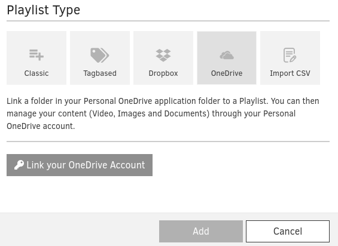
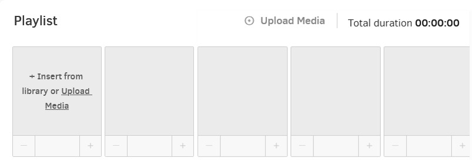
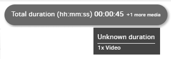
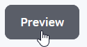

# Playlists

## Table des matières

*   [Ajouter une playlist](#ajouter-une-playlist)
*   [Options de transition et de lecture](#options-de-transition-et-de-lecture)
    *   [Limitations](#limitations)
    *   [Garder les pages Web ouvertes en arrière-plan](#garder-les-pages-web-ouvertes-en-arrière-plan)
*   [Ajouter des médias à une playlist](#ajouter-des-médias-à-une-playlist)
    *   [Affectation directe](#affectation-directe)
    *   [Actions de la playlist](#actions-de-la-playlist)
    *   [Quels médias sont calculés ? Les médias calculés sont :](#quels-médias-sont-calculés-les-médias-calculés-sont)
*   [Créer/Éditer des playlists avec un grand nombre de fichiers multimédias](#créeréditer-des-playlists-avec-un-grand-nombre-de-fichiers-multimédias)
*   [Comment prévisualiser le contenu de la playlist ?](#comment-prévisualiser-le-contenu-de-la-playlist)
    *   [Autoriser les pop-ups](#autoriser-les-pop-ups)
*   [Gérer les playlists](#gérer-les-playlists)
*   [Paramètres de contrôle supplémentaires](#paramètres-de-contrôle-supplémentaires)

### Ajouter une playlist

Pour ajouter une playlist, cliquez sur le bouton "Ajouter une playlist" en bas de la liste des playlists.

*   Ensuite, vous devez sélectionner le type de playlist que vous souhaitez créer. Vous pouvez choisir parmi :
    *   **Classique** – Créez une playlist classique. Après avoir cliqué sur "Ajouter", vous pourrez sélectionner les médias que vous souhaitez ajouter à la playlist.
    *   **Basée sur les tags** – Créez une playlist dynamique en utilisant des tags de médias. La playlist se mettra à jour dynamiquement chaque fois que vous attribuerez ou supprimerez des tags de vos médias.
    *   **Dropbox** – Liez un dossier dans votre Dropbox à une playlist. Vous pouvez ensuite gérer votre contenu (vidéos, images et documents) via votre compte Dropbox.
    *   **OneDrive** – Liez un dossier dans votre application OneDrive personnelle à une playlist. Vous pouvez ensuite gérer votre contenu (vidéos, images et documents) via votre compte OneDrive personnel.
    *   **Importer CSV** – Créez une playlist en important un fichier texte. Chaque ligne doit contenir le nom de l'élément multimédia à ajouter, éventuellement suivi d'une virgule et de la durée de lecture pour ce média.

*   Ensuite, vous devez fournir :
    *   le **Nom** de la playlist et
    *   une **Description** optionnelle pour celle-ci
    *   Il existe diverses options de paramètres que vous pouvez activer. Elles sont séparées entre **Options de transition** et **Options de lecture**.

### Options de transition et de lecture

#### Options de transition

**Ajouter un intervalle noir entre les vidéos**

*   La transition entre les deux vidéos est actuellement sans intervalle. Le dernier cadre vidéo affichera l'écran avec des transitions sans intervalle entre les vidéos consécutives. Si vous souhaitez un intervalle noir de 0,5 seconde entre les vidéos, activez l'option ci-dessus sur votre playlist.

**Transitions d'images**

*   Vous pouvez choisir parmi plus de 23 **types de transition** différents et, bien sûr, contrôler la **vitesse de transition**.
*   **Lente** : transition de 3 secondes
*   **Moyenne** : transition de 2 secondes
*   **Rapide** : transition de 1 seconde
*   **Personnalisée** : configurez la durée de la transition d'une image à l'autre.

#### Limitations

Nous améliorons la fonctionnalité de transition quotidiennement, mais il y a certaines limitations que vous devez prendre en compte pour le moment.

1. Les transitions sont disponibles **uniquement** entre les images. Vous ne pouvez pas avoir de transitions entre les images et les vidéos ou tout autre média.

2. Si vous ajoutez une playlist à une mise en page, n'activez pas l'option de transparence sur cette couche. Les transitions ne fonctionneront pas avec l'option de transparence activée.

3. Les transitions ne sont **pas** encore disponibles pour la résolution 4K.

#### Transition et sous-playlists

Lorsque vous activez les transitions dans une playlist parente, toutes les sous-playlists avec des transitions actives hériteront du **type** et de la **vitesse** de transition de la **playlist parente**.

#### Options de lecture

**Lecture synchronisée**

Les lecteurs sous le même compte peuvent être synchronisés et afficher le contenu à l'écran de manière synchronisée, presque image par image.

**Lecture aléatoire**

*   Choisissez d'activer l'option "Lecture aléatoire". Cette option randomisera les médias de votre playlist, et le lecteur affichera ces médias à l'écran de manière aléatoire.

**Garder les pages Web ouvertes**

*   Choisissez d'activer l'option "Garder les pages Web ouvertes". Cette option sera affichée dans les paramètres de votre playlist si vous avez au moins une entrée de page Web dans la bande de votre playlist.

#### Garder les pages Web ouvertes en arrière-plan

Normalement, les pages Web et les widgets Web dans une playlist sont rechargés à chaque fois qu'ils sont affichés. Cependant, vous pouvez activer cette option pour les garder ouverts en arrière-plan.

Par défaut, les pages Web dans une playlist sont fermées et rechargées à chaque fois qu'elles apparaissent à l'écran. En activant cette option, vous gardez toutes les pages Web de la playlist ouvertes et ne les rechargez jamais. Pour définir un intervalle de rafraîchissement, consultez les paramètres "Avancé" de chaque page Web.

Par exemple, si vous avez des tableaux de bord qui doivent être rafraîchis fréquemment pour afficher du nouveau contenu, en activant cette option, les tableaux de bord resteront actifs dans la RAM de votre lecteur pour être affichés instantanément à l'écran au lieu de se charger à nouveau depuis le début.

#### Utilisation de la RAM

Cette fonctionnalité ne doit être utilisée qu'avec des lecteurs basés sur la dernière carte Raspberry Pi 4 avec 2 Go, 4 Go ou 8 Go de RAM. L'utilisation de cette fonctionnalité sur des lecteurs avec des cartes de 1 Go peut entraîner une instabilité et une corruption du lecteur si l'utilisation de la mémoire est trop élevée.

**IMPORTANT :** Cela peut réduire la fiabilité du lecteur si la mémoire est trop élevée. Nous recommandons d'utiliser des lecteurs Raspberry Pi 4 avec 2 Go, 4 Go ou 8 Go de RAM.

### Ajouter des médias à une playlist

Vous pouvez voir une bande vide où vous ajouterez vos fichiers multimédias :

Sous la bande, vous trouverez la bibliothèque multimédia de votre compte avec tous les fichiers multimédias disponibles. Vous pouvez les voir tous ou les localiser sous leur catégorie respective (Images, Vidéos, Pages Web, Applications, Ressources audio, Documents, Playlists et Mises en page).

Le premier élément de la bibliothèque multimédia est la **playlist cachée** spéciale. Vous pouvez l'utiliser pour masquer la playlist aussi longtemps que vous le souhaitez. Si vous l'utilisez dans une playlist, lorsque celle-ci se charge, l'écran du lecteur deviendra noir car il n'y a pas de média à lire. Lorsque sa durée se termine, la playlist continue avec le média suivant.

Cela est utile lorsque vous souhaitez créer des couches dans une mise en page. Par exemple, vous pouvez insérer un fichier multimédia dans une mise en page, et par-dessus, vous pouvez insérer une playlist avec vos médias plus l'élément **playlist cachée**. Si vous utilisez la mise en page sur votre écran, vous verrez la couche supérieure, la playlist. Lorsque la playlist charge l'élément playlist cachée, il disparaîtra temporairement, révélant le média en dessous, le premier média que vous avez inséré dans la mise en page. Lorsque la playlist cachée se termine, elle reprend et continue avec les médias restants, masquant la couche inférieure dans la mise en page.

#### Affectation directe

Avec l'option d'affectation directe, vous pouvez ajouter **un ou plusieurs** médias à **une ou plusieurs** playlists en même temps.

#### Actions de la playlist

*   Vous pouvez utiliser le bouton **Rechercher** pour trouver votre fichier multimédia.
*   En survolant n'importe quel média, vous pouvez :
    *   Cliquer sur le bouton **Aperçu** (icône en forme d'œil) pour prévisualiser le média spécifique
    *   Cliquer sur le bouton **Flèche** pour le placer dans la playlist
        *   Alternativement, vous pouvez **glisser-déposer** l'élément directement dans la bande
    *   Cliquer sur le bouton **Crayon** pour éditer le média spécifique
*   **Téléchargez n'importe quel média** directement sur votre playlist en cliquant sur le bouton "+Télécharger des médias"
*   Vous pouvez changer la position des fichiers multimédias en les glissant et en les déposant dans l'ordre souhaité.
*   Tous les médias insérés dans la playlist héritent de leur durée par défaut, sauf les **vidéos** avec une durée d'affichage fixe (la durée de la vidéo elle-même), qui ne peut pas être modifiée.
*   Vous pouvez utiliser les icônes **- / +** pour diminuer/augmenter la durée.
*   Vous pouvez également vérifier la durée totale de votre playlist. Cette information se trouve sur le côté droit de la bande :

#### Quels médias sont calculés ? Les médias calculés sont :

*   Images
*   Pages Web
*   Applications
*   Vidéos (les vidéos YouTube sont exclues)
*   Documents

En cliquant sur "Enregistrer", vous créerez la playlist.

### Créer/Éditer des playlists avec un grand nombre de fichiers multimédias

Si vos playlists contiennent de nombreux fichiers multimédias, vous pouvez activer la **Vue en dossier** pour votre commodité.

### Comment prévisualiser le contenu de la playlist ?

Vous pouvez voir exactement ce qui est affiché sur vos écrans de télévision comme si vous visualisiez ce contenu avec un lecteur connecté à votre écran. D'un simple clic, vous pouvez voir comment votre playlist sera affichée à l'écran sans avoir besoin d'un lecteur ou de matériel.

Vous devez simplement remplir la playlist avec les médias de votre choix, puis cliquer sur le bouton **Aperçu** en haut à gauche.

Une nouvelle fenêtre apparaîtra et la playlist commencera à être affichée.

#### Autoriser les pop-ups

Votre navigateur peut bloquer le pop-up lorsque vous cliquez sur le bouton Aperçu. Veuillez cliquer sur le bouton des options dans votre navigateur et cliquer sur "Autoriser les pop-ups".

### Gérer les playlists

Vous pouvez voir une liste des playlists actuellement créées dans votre compte dans la section Playlists. Les informations sur vos playlists sont organisées dans les colonnes suivantes :

*   Le **Nom** de la playlist
*   La **Description** de celle-ci (le cas échéant)
*   Le **Horodatage** (date et heure) de la dernière modification de la playlist
*   Les icônes du **Type de média** inclus dans la playlist
*   Le **Workspace** (pour les comptes du plan **Enterprise**) auquel appartient l'image
*   La colonne **Actions**

Si vous cliquez sur l'icône à trois points dans la colonne Actions, vous verrez une liste d'actions que vous pouvez appliquer à vos playlists.

Cliquez sur chaque onglet ci-dessous pour voir une brève description.

Modifier Dupliquer Déplacer Supprimer

Changez les détails d'une playlist en cliquant sur le bouton "Modifier". Consultez la section "Ajouter une playlist" ci-dessus pour plus de détails.

Créez une copie exacte de la playlist avec un nouveau nom.

Vous pouvez déplacer des playlists vers d'autres Workspaces (pour les comptes du plan **Enterprise**).

Supprimez la playlist.

### Paramètres de contrôle supplémentaires

La boîte de recherche en haut à gauche vous permet de trier rapidement votre liste de playlists. Vous pouvez rechercher en utilisant n'importe quelle colonne par nom, date, workspace, etc.

Vous pouvez sélectionner plusieurs playlists en cliquant sur la case carrée à gauche de leur vignette. Cliquez sur le bouton **Actions** en bas pour déplacer ou supprimer toutes les playlists sélectionnées en une seule fois.

