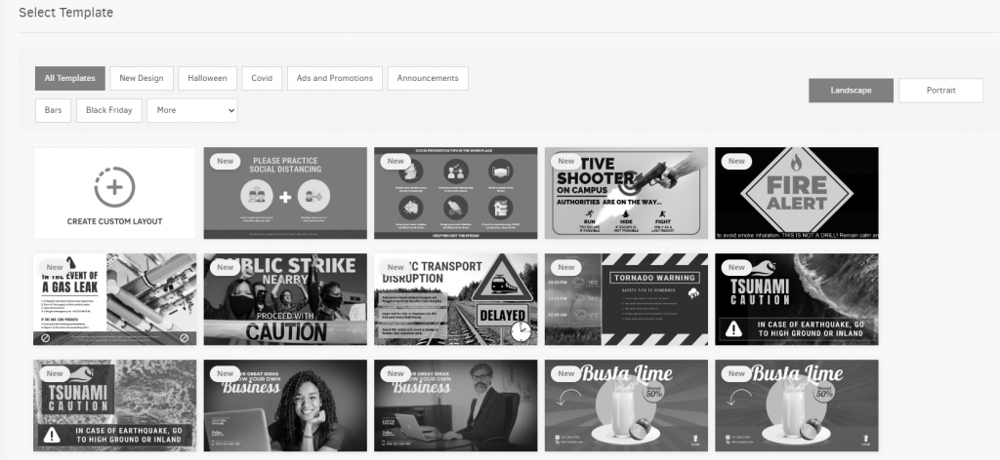
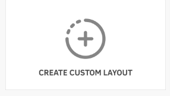
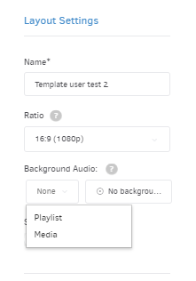
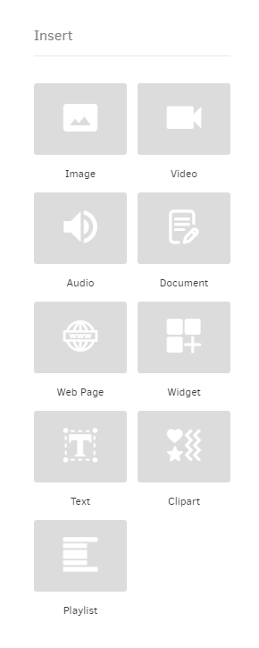
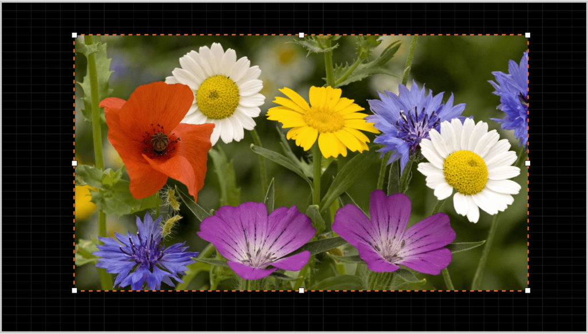
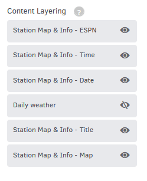
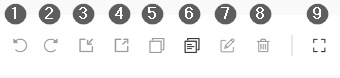

# 7. Mises en page

## Table des matières

*   [Introduction](#introduction)
*   [Créer une mise en page](#créer-une-mise-en-page)
*   [Ajouter un modèle](#ajouter-un-modèle)
    *   [1. Qu'est-ce que les modèles ?](#1-quest-ce-que-les-modèles)
    *   [2. Importer un modèle](#2-importer-un-modèle)
*   [Ajouter une mise en page personnalisée](#ajouter-une-mise-en-page-personnalisée)
*   [Paramètres de mise en page](#paramètres-de-mise-en-page)
    *   [Ratio d'aspect](#ratio-daspect)
    *   [Médias muets](#médias-muets)
*   [Ajouter des médias depuis votre bibliothèque](#ajouter-des-médias-depuis-votre-bibliothèque)
*   [Éditer des médias](#éditer-des-médias)
    *   [1. Option d'ajustement](#1-option-dajustement)
    *   [2. Transparence](#2-transparence)
*   [Positionner/Redimensionner des médias dans l'éditeur de mise en page](#positionnerredimensionner-des-médias-dans-léditeur-de-mise-en-page)
*   [Superposition de contenu](#superposition-de-contenu)
*   [Outils utiles](#outils-utiles)
*   [Comment prévisualiser une mise en page avant de la pousser vers le lecteur ?](#comment-prévisualiser-une-mise-en-page-avant-de-la-pousser-vers-le-lecteur)
*   [Gérer les mises en page](#gérer-les-mises-en-page)
*   [Paramètres de contrôle supplémentaires](#paramètres-de-contrôle-supplémentaires)

### Introduction

Avec les mises en page, vous pouvez créer la mise en page finale affichée sur vos écrans en combinant des playlists déjà créées, des fichiers multimédias téléchargés et des applications.

### Créer une mise en page

Pour créer une mise en page, cliquez sur le bouton "Ajouter une mise en page" en bas de la liste. Une nouvelle page s'ouvrira, affichant de nombreux modèles de mise en page préconçus que nous avons créés pour vous et prêts à l'emploi.

N'hésitez pas à choisir parmi les modèles disponibles et à les éditer en changeant les images et en ajoutant le texte que vous souhaitez. Sinon, vous pouvez créer votre propre mise en page personnalisée à partir de zéro !

### Ajouter un modèle

#### 1. Qu'est-ce que les modèles ?

Les modèles sont des mises en page pré-formatées que nous avons créées pour que vous puissiez les utiliser directement sur vos écrans de télévision. Ces modèles d'affichage offrent une large gamme d'options de contenu statique et dynamique. Les deux options sont disponibles, que vous souhaitiez incorporer des éléments statiques comme des photos ou du texte qui restent les mêmes à chaque fois qu'ils sont affichés sur vos lecteurs, ou incorporer du contenu dynamique qui se met à jour automatiquement en fonction de la météo, de l'heure ou de l'emplacement de votre enseigne. Les modèles utilisent des médias non stockés dans votre compte mais dans le cloud pour être disponibles pour tous les utilisateurs. Bien sûr, vous pouvez les éditer comme bon vous semble.

#### 2. Importer un modèle

En cliquant sur le modèle de mise en page de votre choix, une fenêtre s'affichera avec un aperçu de celui-ci. Ensuite, si vous l'aimez, vous pouvez l'importer en cliquant sur le bouton "Importer le modèle" ou revenir en arrière pour en choisir un nouveau en cliquant sur le bouton "Retour aux modèles". Après avoir importé un modèle, vous pouvez le nommer comme vous le souhaitez et éditer les médias par défaut pour le personnaliser selon vos besoins.

### Ajouter une mise en page personnalisée

Pour ajouter une mise en page personnalisée, cliquez sur le bouton "CRÉER UNE MISE EN PAGE PERSONNALISÉE" trouvé au début de la liste.

### Paramètres de mise en page

Avant d'ajouter des médias, vous verrez un panneau de configuration sur le côté droit de votre écran. Pour voir une brève description des options, cliquez sur l'onglet correspondant ci-dessous :

Nom Ratio Audio de fond Ajuster à la grille

Tapez le nom de votre mise en page.

Choisissez le ratio de votre mise en page pour qu'il corresponde au ratio de votre écran. Vous pouvez choisir entre Paysage ou Portrait.

#### Ratio d'aspect

Si le ratio de votre écran de télévision n'est pas affiché dans cette liste, vous pouvez créer un ratio personnalisé en cliquant sur le bouton "Ajouter un ratio personnalisé" dans la liste des ratios.

Avec cette fonctionnalité, vous pouvez définir l'audio de fond de votre choix pour les médias dans votre configuration de mise en page.

Vous pouvez choisir l'un des types de médias suivants comme audio de fond :

Playlists
Ressources audio
Pages Web (stations de radio en direct, flux, etc.)
Vidéos (son uniquement)

#### Médias muets

Tous les autres médias dans l'éditeur de mise en page seront muets lors de l'activation et de la configuration d'un audio de fond de votre choix. En conséquence, seul l'audio de fond sélectionné sera entendu depuis les haut-parleurs de votre écran.

Vous avez également la possibilité de désactiver "Ajuster à la grille" sur votre simulateur d'écran, ce qui modifiera la façon dont vous placez l'élément en le faisant glisser. Désactiver la grille vous permet de placer l'élément n'importe où sur le simulateur d'écran.

### Ajouter des médias depuis votre bibliothèque

Cliquez sur "Insérer" dans la barre supérieure pour choisir un média de votre galerie multimédia. Dans le panneau de droite, vous verrez toutes les options disponibles proposées.

*   Images
*   Vidéos
*   Audio
*   Documents
*   Pages Web
*   Widgets
*   Textes
*   Cliparts
*   Playlists

### Éditer des médias

Certaines options de configuration pertinentes sont affichées dans le panneau de droite en choisissant un fichier multimédia.

Par exemple, si vous sélectionnez une **Image, Vidéo, Audio, Document, Page Web, Widget, et Playlist**, vous serez présenté avec les paramètres suivants :

#### 1. Option d'ajustement

*   **"Ajuster" :** afficher tout le contenu dans la zone assignée (peut ajouter de l'espace ou des barres noires sur les bords, mais ne déformera pas les images ou les vidéos).
*   **"Recadrer" :** zoomer pour couvrir toute la zone assignée (peut recadrer certains bords, mais ne déformera pas les images ou les vidéos).
*   **"Étirer" :** afficher tout le contenu, en l'étirant pour correspondre à la zone assignée (pas de recadrage, d'espaces vides ou de barres noires, mais peut déformer les images et les vidéos).

#### 2. Transparence

Optionnellement, activez le basculement "Autoriser la transparence" pour permettre la transparence de la région. Cela est utile pour le contenu avec transparence et l'option "Ajuster" ci-dessus.

### Positionner/Redimensionner des médias dans l'éditeur de mise en page

Sélectionner des médias importés dans l'éditeur de mise en page ouvre des options de configuration sur le côté droit de votre écran.

Vous pouvez utiliser les valeurs **Largeur**, **Hauteur**, **Haut**, **Gauche** pour les positionner et les aligner rapidement où vous le souhaitez. Vous pouvez soit taper directement la valeur souhaitée, soit, en plaçant votre curseur de souris dans la case, utiliser la molette de la souris pour augmenter/diminuer la valeur.

Une autre façon de positionner/redimensionner votre élément multimédia est de le sélectionner avec votre souris et de le faire glisser à n'importe quelle position souhaitée. Cliquer sur un élément multimédia le mettra en surbrillance. Utilisez les carrés blancs pour faire glisser/redimensionner le média à volonté.

#### Verrouiller le ratio d'aspect

Si vous souhaitez que le média que vous déplacez/redimensionnez conserve le même ratio dans toute la région de mise en page, activez le basculement "Verrouiller le ratio d'aspect".

### Superposition de contenu

Dans le panneau de droite, lorsque vous n'avez pas sélectionné de média, sous la section "Superposition de contenu", tous les éléments (playlists, widgets, fichiers multimédias) ajoutés à la mise en page sont listés dans l'ordre où vous les avez ajoutés, avec la couche supérieure représentant le dernier élément ajouté.

Cet ordre de superposition est très facilement modifiable en faisant glisser et en déposant les éléments dans la hiérarchie souhaitée.

Dans la configuration de superposition, vous avez la possibilité de désactiver rapidement certains éléments en cliquant sur le bouton "œil" à côté du média de votre choix. Les médias cachés ne seront pas affichés sur le lecteur non plus.

Vous pouvez rétablir les médias dans votre éditeur de mise en page en cliquant à nouveau sur le bouton "œil".

### Outils utiles

Dans la barre supérieure, vous remarquerez des boutons utiles que vous pouvez utiliser pour vous aider à créer votre mise en page plus rapidement.

1.  **Annuler** : Annulez une modification que vous avez apportée en travaillant dans votre éditeur de mise en page si vous le souhaitez, jusqu'à 30 modifications. **Raccourci** : CTRL+Z
2.  **Rétablir** : Rétablissez une annulation jusqu'à 30 modifications. **Raccourci** : CTRL+Y
3.  **Envoyer en arrière** : Déplacez le média en arrière si vous avez de nombreuses couches de contenu dans votre éditeur de mise en page.
4.  **Amener en avant** : Déplacez le média en avant si vous avez de nombreuses couches de contenu dans votre éditeur de mise en page.
5.  **Copier** : Copiez n'importe quel média dans votre zone d'éditeur de mise en page. Vous pouvez copier des médias de différents éditeurs de mise en page dans votre compte. **Raccourci** : CTRL+C
6.  **Coller** : Collez n'importe quel média dans votre zone d'éditeur de mise en page. Vous pouvez coller des médias de différents éditeurs de mise en page dans votre compte. **Raccourci** : CTRL+V
7.  **Éditer** : Éditez les paramètres du média sélectionné en ouvrant un nouveau formulaire d'édition du média sélectionné.
8.  **Supprimer** : Supprimez le média sélectionné de l'éditeur de mise en page. **Raccourci** : Touche Suppr
9.  **Plein écran** : En cliquant sur le bouton Plein écran, la mise en page que vous avez créée remplira tout votre écran de télévision. De cette façon, vous pouvez modifier la sortie finale affichée sur votre écran de télévision et apporter les ajustements nécessaires en déplaçant n'importe quel média dans n'importe quelle direction ou position de votre choix. C'est comme l'éditeur de mise en page habituel mais en mode plein écran. Appuyez sur la touche Échap de votre clavier pour quitter le plein écran.

### Comment prévisualiser une mise en page avant de la pousser vers le lecteur ?

Cette fonctionnalité est actuellement en phase bêta et aura bientôt toutes les fonctionnalités d'un lecteur. En d'autres termes, vous pourrez voir exactement ce qui est affiché sur votre écran de télévision ; de la même manière que vous verriez ce contenu si vous aviez un lecteur connecté à votre écran.

D'un simple clic, vous pouvez voir comment votre mise en page sera affichée sur l'écran de télévision sans avoir besoin d'un lecteur ou de tout matériel.

La seule chose que vous avez à faire est de remplir la mise en page avec les médias de votre choix, puis de cliquer sur le bouton "Prévisualiser" en haut à droite.

Une nouvelle fenêtre apparaîtra et commencera à afficher la mise en page.

#### Autoriser les pop-ups

En cliquant sur le bouton "Prévisualiser", votre navigateur peut bloquer le pop-up. Veuillez cliquer sur le bouton des options dans votre navigateur et cliquer sur "Autoriser les pop-ups".

### Gérer les mises en page

Dans la section "Mises en page", vous pouvez voir une liste des mises en page actuellement créées dans votre compte. Les informations sur les mises en page sont organisées dans les colonnes suivantes :

*   le **Nom** de la mise en page
*   le **Horodatage** (date et heure) de la dernière modification de la mise en page
*   le **Workspace** auquel appartient la mise en page
*   la colonne **Actions**

Si vous cliquez sur l'icône à trois points dans la colonne Actions, vous verrez une liste d'actions que vous pouvez appliquer à vos mises en page.

Cliquez sur chaque onglet ci-dessous pour voir une brève description.

Modifier Dupliquer Déplacer Supprimer

Changez les détails de la mise en page en cliquant sur le bouton "Modifier". Consultez la section "Créer une mise en page" ci-dessus pour plus de détails sur les champs.

Créez une copie exacte de la mise en page avec un nouveau nom.

Vous pouvez déplacer des mises en page vers d'autres Workspaces (pour les comptes du plan "Enterprise").

Supprimez la mise en page.

### Paramètres de contrôle supplémentaires

Dans le coin supérieur gauche, vous pouvez utiliser la boîte de recherche pour trier rapidement votre liste de mises en page. Vous pouvez rechercher en utilisant n'importe quelle colonne par nom, date, workspace, etc.

Vous pouvez sélectionner une ou plusieurs mises en page en cliquant sur la case carrée à gauche de leur vignette. Vous pouvez ensuite cliquer sur le bouton "Actions" en bas pour déplacer ou supprimer toutes les mises en page sélectionnées en une seule fois.

