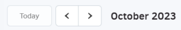
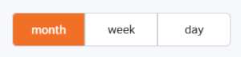
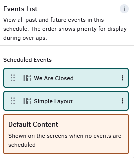
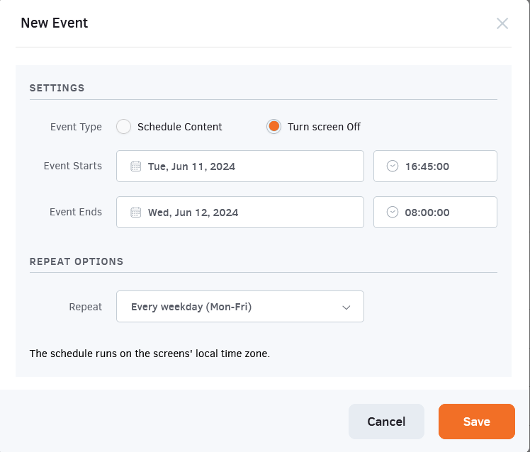
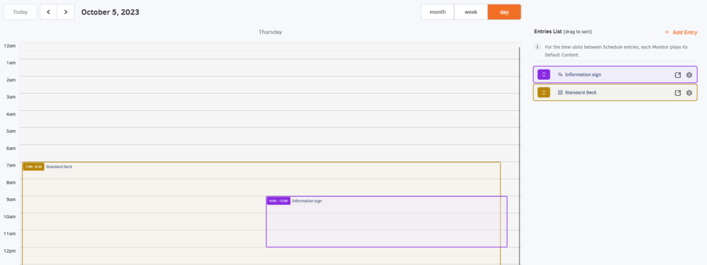

# 8. Planning

## Table des matières

- [Introduction](#introduction)
- [Créer un horaire](#créer-un-horaire)
  - [Fuseau horaire](#fuseau-horaire)
  - [Exemple 1](#exemple-1)
  - [Exemple 2](#exemple-2)
  - [Exemple 3](#exemple-3)
- [Gestion des horaires](#gestion-des-horaires)
- [Paramètres de contrôle supplémentaires](#paramètres-de-contrôle-supplémentaires)

## Introduction

Dans cette section, vous pouvez créer des horaires pour afficher les mises en page, les médias et les playlists que vous avez créés à des dates et heures spécifiques. Les horaires aident à gérer la fréquence à laquelle le contenu est affiché.

## Créer un horaire

Pour créer un nouvel horaire, cliquez sur le bouton “**Ajouter un horaire**” en bas de la liste des horaires. L'étape suivante consiste à nommer votre nouvel horaire et à configurer les mises en page, les médias ou les playlists que vous souhaitez afficher.

Le calendrier vous permet de visualiser le mois, la semaine ou même le jour de votre choix en cliquant sur les boutons correspondants. Vous pouvez voir la date actuelle ; cependant, vous pouvez passer au mois/semaine/jour précédent ou suivant en cliquant sur les flèches à côté du bouton “Aujourd'hui”.

Sur le côté droit de l'écran, il y a la colonne “**Événements**” sous laquelle vous pouvez trouver tous les événements programmés que vous avez créés dans cet horaire spécifique.

### Fuseau horaire

L'horaire fonctionnera selon le fuseau horaire du lecteur auquel il est attribué. Cela signifie qu'un horaire qui commence à 9h et se termine à 21h est attribué à un écran avec le fuseau horaire America/New York configuré ; il commencera à 9h heure de New York.

Comme prochaine étape, faites glisser et déposez lorsque vous souhaitez programmer le contenu. Utilisez le menu déroulant à côté du contenu pour choisir entre une catégorie de mise en page, de média ou de playlist dans la fenêtre “Nouvel événement” qui apparaît. Une fois que vous avez choisi une catégorie de contenu (c'est-à-dire une mise en page), un nouveau menu déroulant apparaîtra, à partir duquel vous pourrez sélectionner la mise en page, le média ou la playlist spécifique que vous souhaitez utiliser dans votre horaire.

- Pour définir la date et l'heure de début de l'affichage de votre mise en page, média ou playlist, remplissez les informations dans la case “**Début de l'événement**”. Pour programmer l'heure, cliquez sur l'icône de l'horloge.
- Pour définir la date et l'heure de fin du contenu que vous allez afficher, remplissez les informations dans la case “**Fin de l'événement**”. Pour programmer l'heure, cliquez sur l'icône de l'horloge.
- La case suivante, “**Répéter**“, indique la fréquence à laquelle votre mise en page, média ou playlist sera affichée. Cliquez pour choisir l'une des options fournies :
  - **Une fois**
    - Si vous souhaitez que votre mise en page, média ou playlist soit lue uniquement pendant des heures spécifiques à une date/jour spécifique.
  - **Quotidien**
    - Si vous souhaitez définir quels jours de la semaine vous souhaitez que votre mise en page, média ou playlist soit lue.
  - **Hebdomadaire**
    - Si vous souhaitez que votre mise en page, média ou playlist soit affichée une fois par semaine.
  - **Mensuel**
    - Si vous souhaitez que votre mise en page, média ou playlist soit affichée une fois par mois.
  - **Annuel**
    - Si vous souhaitez que votre mise en page, média ou playlist soit affichée une fois par an.
  - **Personnalisé**
    - Répéter tous les X jours/semaines/mois/années
    - **Se termine**
      - **Jamais**: L'événement n'expirera jamais.
      - **Le**: Définissez la date spécifique à laquelle l'événement expirera. En d'autres termes, il cessera d'être affiché à l'écran.
      - **Après**: Définissez le nombre d'occurrences pour lesquelles l'événement expirera.
- Enfin, “**Répéter jusqu'à**” indique la période pendant laquelle vous souhaitez définir votre horaire. Vous pouvez sélectionner une date et une heure spécifiques ou cliquer sur “**Pour toujours**” pour que votre horaire soit toujours affiché comme indiqué.

### Exemple 1

L'option “**Éteint**” éteindra votre écran quotidiennement (sauf les samedis et dimanches) de 16:45:00 à 08:00:00 le lendemain.

### Exemple 2

Dans l'exemple suivant, nous avons programmé une mise en page pour apparaître de 7h à 21h et ajouté un autre événement, affichant une playlist de 9h à 12h.

**Avec la configuration ci-dessus:**

- La mise en page sera lue de 7h à 21h.
- La playlist sera lue de 9h à 12h _**(car elle a une fenêtre temporelle plus spécifique)**_
- La mise en page reprendra la lecture à 12h jusqu'à 20h30.

**Priorité du contenu**

Les **horaires** ont priorité sur le **contenu par défaut**. Si une mise en page, un média ou une playlist est attribué comme contenu par défaut sur l'écran et qu'un horaire est également attribué, le contenu par défaut sera affiché à l'écran uniquement _**pendant les intervalles de l'horaire**_.

### Exemple 3

Une option apparaît dans la liste de tous les événements disponibles/créés dans votre compte, et c'est l'option “**Éteint**”. La définition de cette option dans un horaire entraîne l'extinction automatique de votre écran.

## Gestion des horaires

Dans la section “Horaires”, vous pouvez voir une liste des horaires actuellement créés dans votre compte. Les informations sur les horaires sont organisées dans les colonnes suivantes:

- Le nom de l'horaire
- L'horodatage (date et heure) de la dernière modification de l'horaire
- le **Workspace** _(pour les comptes du plan **Enterprise**)_ auquel appartient l'horaire
- la colonne **Actions**

Si vous cliquez sur l'icône à trois points dans la colonne Actions, vous verrez une liste d'actions que vous pouvez appliquer à vos horaires.

- **Modifier**
  - Changez les détails d'un horaire en cliquant sur le bouton “**Modifier**”.
  - Consultez la section “**Créer un horaire**” pour plus de détails sur les champs.
- **Dupliquer**
  - Créez une copie exacte de l'horaire avec un nouveau nom.
- **Déplacer**
  - Vous pouvez déplacer des horaires vers d'autres Workspaces (pour les comptes du plan **Enterprise**).
- **Supprimer**
  - Supprimez l'horaire.

## Paramètres de contrôle supplémentaires

Dans le coin supérieur gauche, vous pouvez utiliser la boîte de recherche pour trier rapidement votre liste d'horaires.
Vous pouvez ensuite cliquer sur le bouton **Actions** en bas pour déplacer ou supprimer tous les horaires sélectionnés simultanément.
Vous pouvez rechercher en utilisant n'importe laquelle des colonnes par nom, date, workspace, etc.
Vous pouvez sélectionner un ou plusieurs horaires en cliquant sur la case carrée à gauche de leur vignette.

