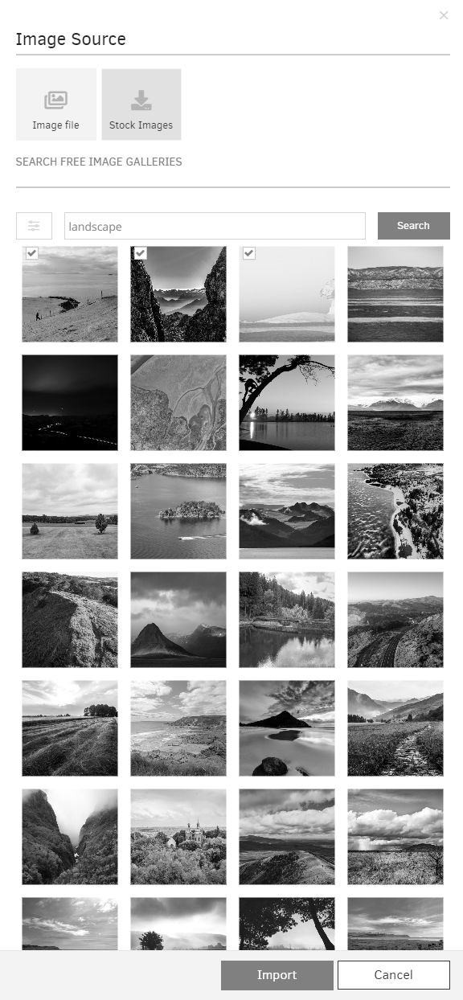

# Images

## Table of Contents
- [Formats supportés](#formats-supportés)
- [Résolution supportée](#résolution-supportée)
- [Ajouter une image](#ajouter-une-image)
- [Ajouter une ou plusieurs images avec l'option glisser-déposer](#ajouter-une-ou-plusieurs-images-avec-loption-glisser-déposer)
- [Gestion des images](#gestion-des-images)
- [Paramètres de contrôle supplémentaires](#paramètres-de-contrôle-supplémentaires)
- [Éditeur Pixie](#éditeur-pixie)
- [Galerie](#galerie)
  - [Ajouter une ou plusieurs images en utilisant la galerie](#ajouter-une-ou-plusieurs-images-en-utilisant-la-galerie)

Dans la section "Images", vous gérez les images utilisées pour la lecture sur vos lecteurs.

## Formats supportés
- Tout type de fichier image affiché dans un navigateur moderne. Cela inclut **JPEG, PNG, SVG et GIF** (_y compris les animations légères_).
- Les images ne sont pas redimensionnées automatiquement ; elles sont livrées et lues exactement comme vous les avez téléchargées.

## Résolution supportée
- Si vous n'utilisez pas notre dernier lecteur 4K et une version précédente de celui-ci, comme le RPi 3B+, il sera sage de redimensionner vos images en Full HD 1920×1080 avant de les télécharger sur votre compte. Les images avec des résolutions énormes peuvent ralentir le lecteur si vous ne le faites pas.
- D'autre part, notre dernier lecteur 4K peut décoder des images 4K, alors n'hésitez pas à télécharger des images 4K sur votre compte et à les afficher sur votre écran TV 4K.

## Ajouter une image
Pour ajouter une seule image, cliquez sur le bouton "Ajouter une image" trouvé dans la liste des images.
Ensuite, vous devez choisir si vous souhaitez télécharger votre propre photo ou sélectionner des photos parmi la vaste gamme d'images gratuites que vous trouverez dans notre **Galerie** (voir la section ci-dessous).
Vous pouvez **Télécharger** une image depuis votre stockage local ou utiliser l'option **Importer depuis l'URL** pour importer un fichier image hébergé dans le cloud.
Pour sélectionner plusieurs fichiers simultanément, vous pouvez maintenir \[Ctrl\] ou \[Shift\].
Après avoir téléchargé avec succès un fichier image, vous pouvez :
1. Saisir le **Nom** de l'image
2. Une **Description** optionnelle
3. Ajouter des **Tags** à l'image téléchargée
4. Définir la **Durée par défaut** de l'image si vous décidez de l'ajouter à une playlist
5. Vous pouvez définir les paramètres **Lire de / Lire jusqu'à** dans les fonctionnalités avancées. En d'autres termes, vous pouvez définir la date d'expiration, ce qui signifie que vous pouvez choisir la date et l'heure exactes auxquelles cette image sera affichée dans votre playlist ou mise en page, ou vous pouvez définir le paramètre "Toujours" et "Pour toujours" et l'image n'expirera jamais.
6. Cliquez sur **Enregistrer** pour enfin télécharger l'image

## Ajouter une ou plusieurs images avec l'option glisser-déposer
Vous pouvez ajouter un fichier en faisant glisser le fichier ou les fichiers spécifiques de votre PC directement dans l'interface utilisateur de la section Images sur le portail, en sautant quelques étapes et en vous faisant gagner du temps supplémentaire.

## Gestion des images
Dans la section "Images", vous pouvez voir une liste des images actuellement téléchargées sur votre compte. Les informations sur les images sont organisées dans les colonnes suivantes :
- le **Nom** de l'image, avec un **Aperçu** (vignette) de l'image réelle
- le **Horodatage** (date et heure) de la dernière modification de l'image
- l'**Espace de travail** (pour les comptes du plan **Entreprise**) auquel appartient l'image
- les **Tags** (pour les comptes des plans **Pro** et **Entreprise**) appliqués au fichier
- la colonne **Actions**

Si vous cliquez sur l'icône des trois points dans la colonne Actions, vous verrez une liste d'actions que vous pouvez appliquer à vos fichiers image téléchargés.
Voir ci-dessous pour une brève description de chaque action :
- **Modifier**
  - Changez les détails de l'image en cliquant sur le bouton "Modifier". Ici, vous pouvez remplacer l'image réelle, qui sera modifiée partout où elle est utilisée. Consultez la section "Ajouter une image" pour plus de détails sur les champs.
- **Dupliquer**
  - Créez une copie exacte du fichier image avec un nouveau nom.
- **Déplacer**
  - Vous pouvez déplacer des fichiers image vers des dossiers et/ou d'autres espaces de travail (pour les comptes du plan **Entreprise**).
- **Supprimer**
  - Supprimez le fichier image.

## Paramètres de contrôle supplémentaires
Vous pouvez utiliser la boîte de recherche pour trier rapidement votre liste d'images en haut à gauche. Recherchez en utilisant quatre colonnes par nom, date, espace de travail et tag.
Sélectionnez une ou plusieurs images en cliquant sur la case carrée à gauche de leur vignette. Vous pouvez cliquer sur le bouton **Actions** en bas pour modifier, déplacer et supprimer toutes les images sélectionnées en une seule fois.
En haut à droite, vous pouvez cliquer sur le bouton "+Ajouter un dossier" pour créer un dossier qui peut être utilisé pour regrouper des fichiers multimédias (le dossier sera global parmi les images, vidéos, audio, documents, pages Web et widgets).
Vous pouvez également modifier la liste et actualiser la vue.

## Éditeur Pixie
Si vous **Modifiez** ou **Dupliquez** une image existante, vous trouverez un bouton avec la description **Ouvrir avec l'éditeur d'images Pixie** sous sa vignette, qui ouvrira un éditeur d'images complet, où vous pouvez modifier l'apparence de l'image (recadrer, faire pivoter, redimensionner), ajouter des filtres, du texte, des autocollants et bien plus encore.

## Galerie
- La galerie vous permet de créer une collection de photos numériques en ajoutant des images gratuites de votre choix. Il y a également un support illimité pour la recherche et la gestion des fichiers image dans votre compte.
- Avec la galerie, entrez un mot-clé (par exemple, Nourriture, Montagnes, Animaux, Lieux, etc.) pour rechercher des images gratuites en ligne. Ensuite, les résultats de recherche d'images sont stockés dans votre compte et vous pouvez les afficher sur vos écrans.
- Vous pouvez choisir parmi des centaines de milliers d'images gratuites.

### Ajouter une ou plusieurs images en utilisant la galerie
- Pour ajouter une ou plusieurs images depuis notre application Galerie, cliquez sur le bouton "Ajouter une image" en bas de la liste des images, puis cliquez sur le bouton "Images gratuites".
- Dans la boîte de recherche, tapez un mot-clé (par exemple, Montagnes) et sélectionnez un fournisseur, une catégorie, une orientation et un type de photo pour rechercher.
- Après avoir cliqué sur le bouton de recherche, notre plateforme affichera toutes les images gratuites disponibles avec ce mot-clé. Si vous souhaitez obtenir plus de résultats, il vous suffit de faire défiler vers le bas. Plus d'images seront chargées au fur et à mesure que vous faites défiler.
- Vous pouvez même prévisualiser l'image en cliquant dessus avant de l'ajouter à votre compte.
- Sélectionnez l'image de votre choix en cochant la petite case blanche dans le coin supérieur gauche de chaque photo, puis en cliquant sur le bouton "Importer".

