# Murs Vidéo

Les murs vidéo sont une fonctionnalité puissante de FrameUp qui vous permet de créer des affichages visuels impressionnants en utilisant plusieurs écrans. Voici comment vous pouvez configurer et utiliser les murs vidéo.

## Configuration des Murs Vidéo

1. **Connexion des Écrans** : Connectez tous les écrans que vous souhaitez utiliser pour le mur vidéo à votre lecteur FrameUp.
2. **Configuration du Logiciel** : Utilisez le portail FrameUp pour configurer les paramètres du mur vidéo. Vous pouvez définir la disposition des écrans, le contenu à afficher, et plus encore.

## Exemples de Murs Vidéo

Voici quelques exemples de murs vidéo que vous pouvez créer :

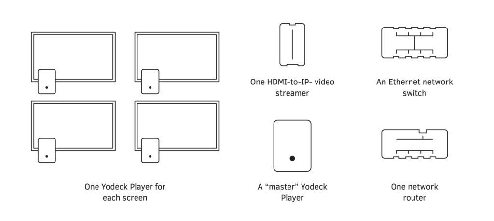

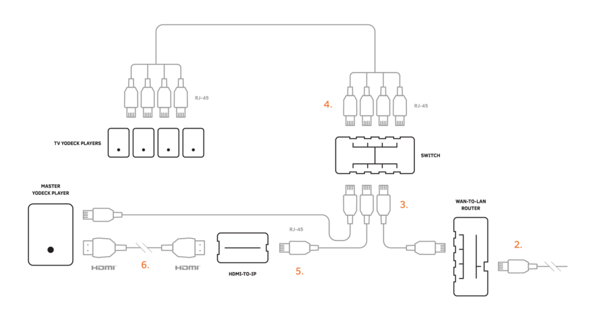

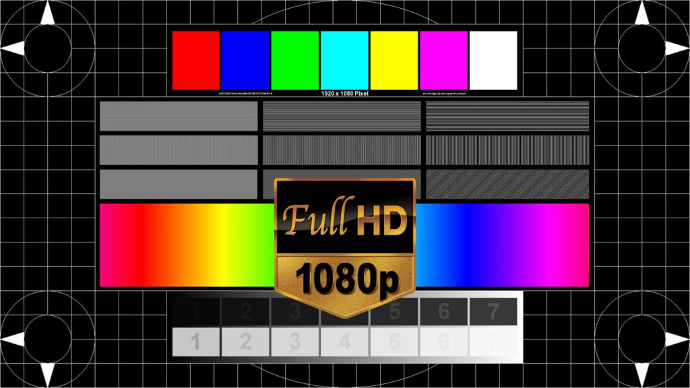

## Ressources Supplémentaires

Pour plus d'informations sur la configuration et l'utilisation des murs vidéo, consultez les ressources suivantes :

- [Guide de Configuration des Murs Vidéo](https://app.frameup.tech/docs/video-walls/)

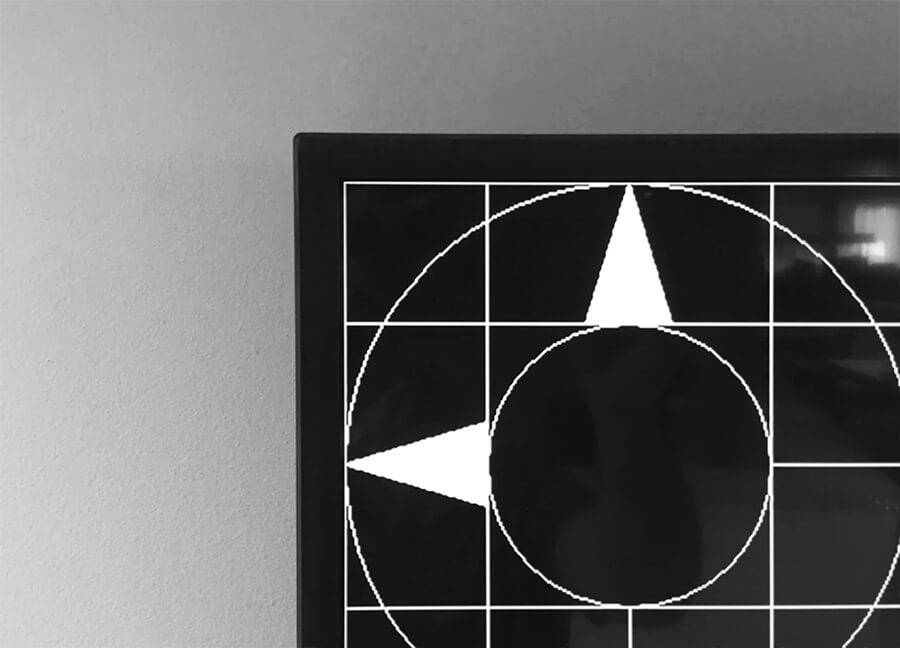

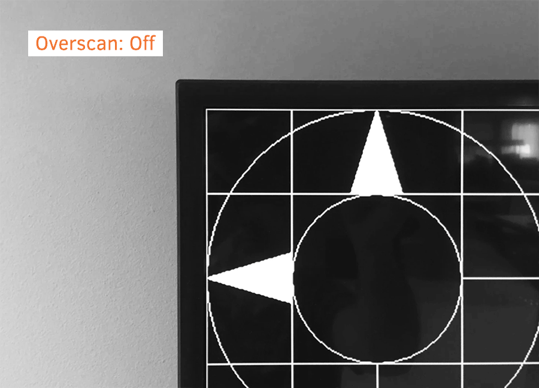

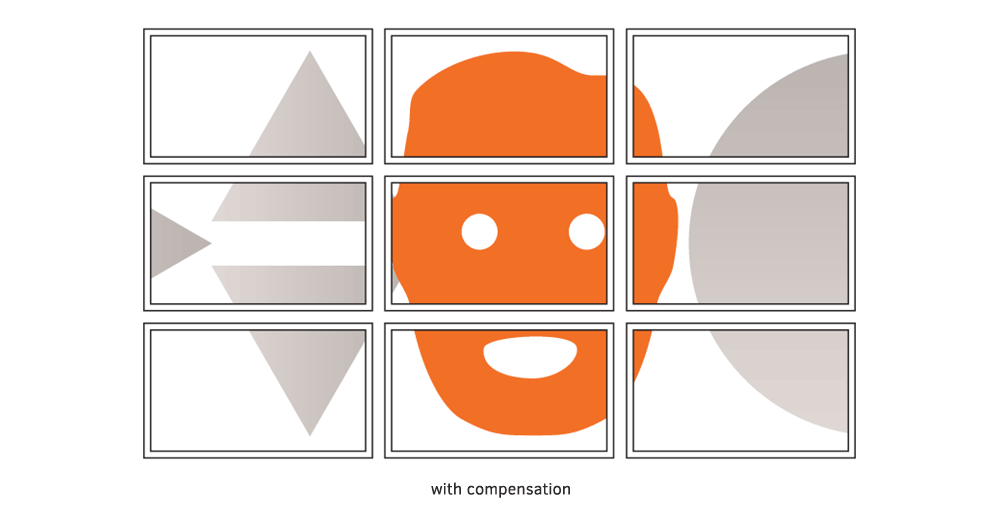

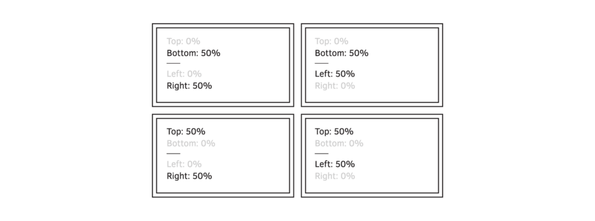

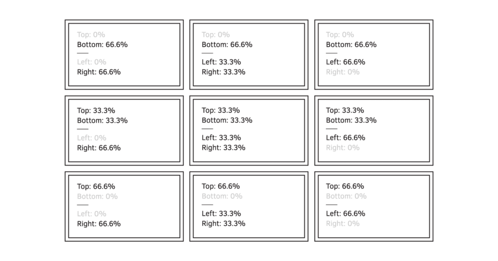

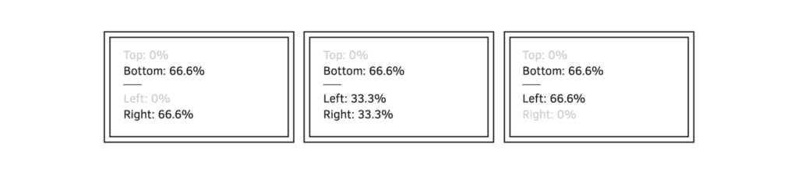

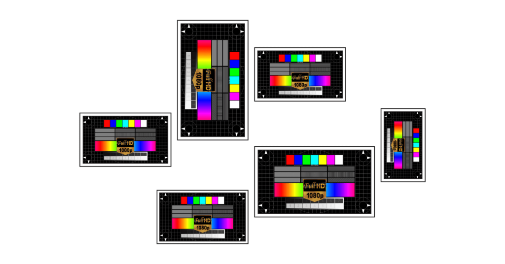

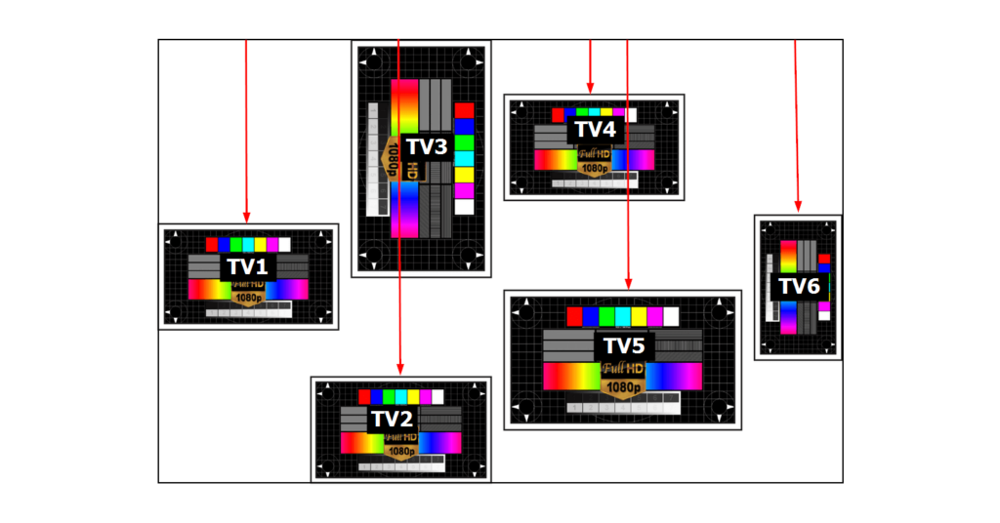

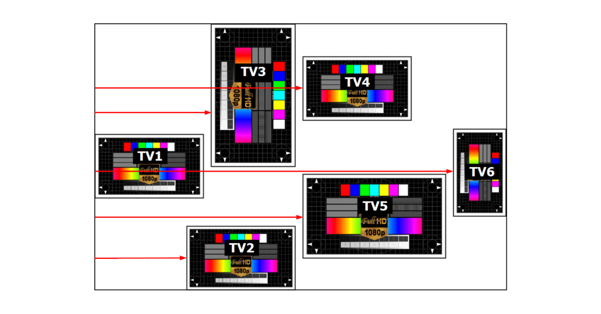

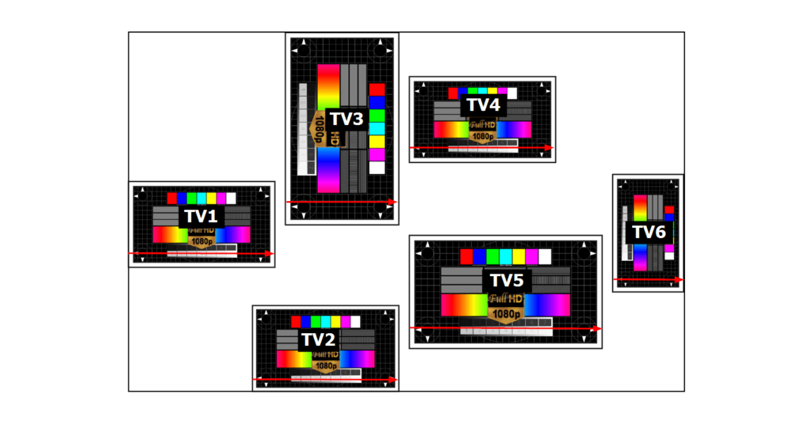

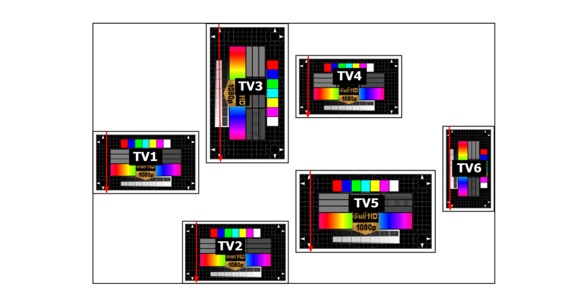

