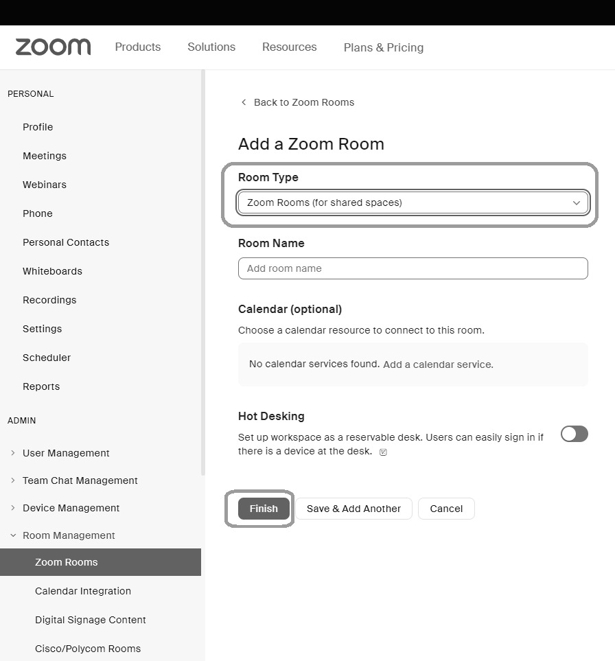
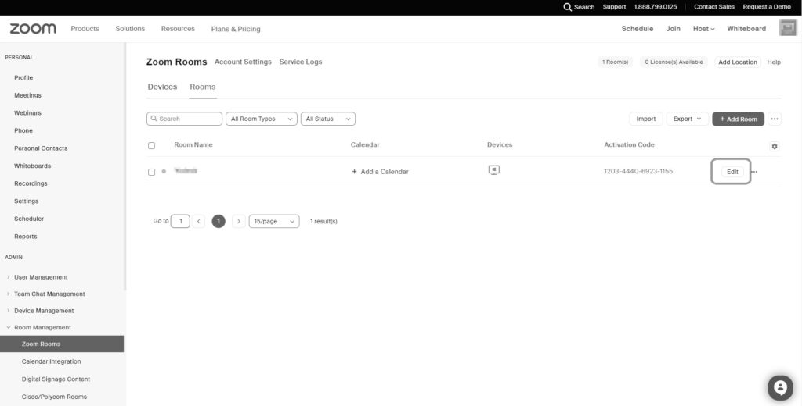
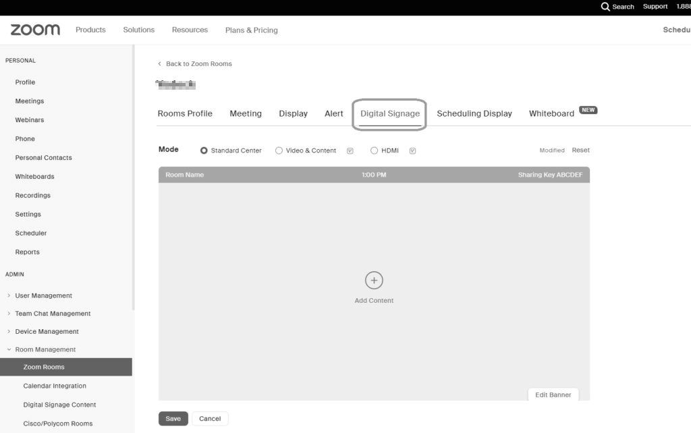
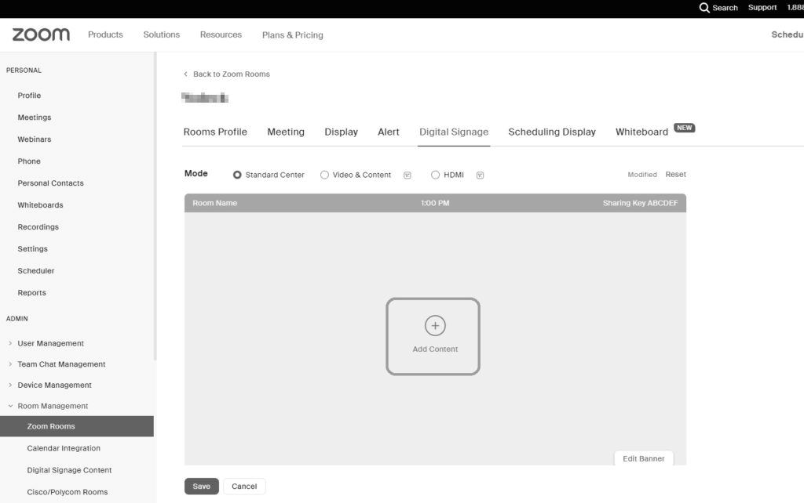
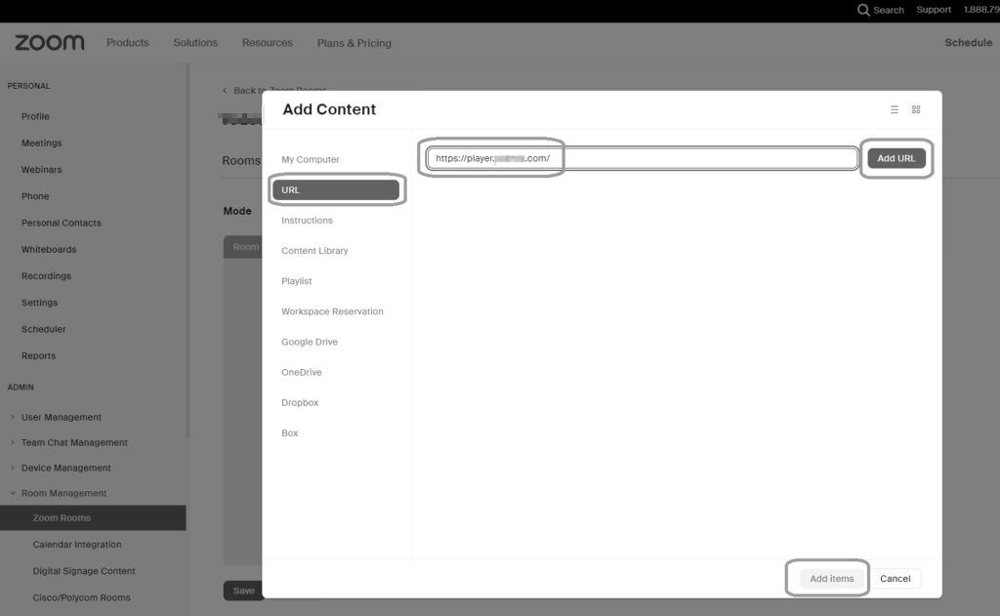
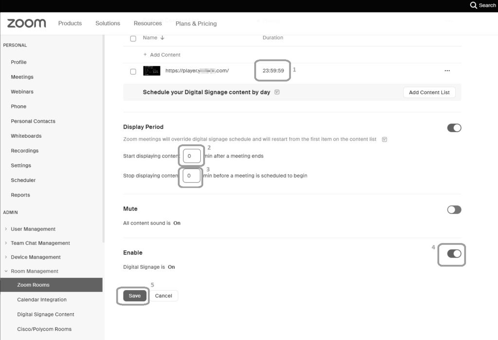
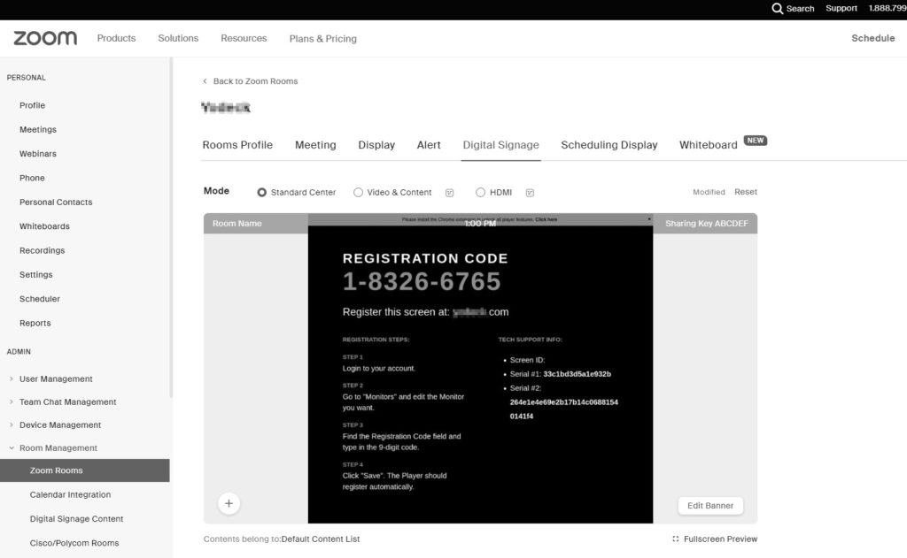
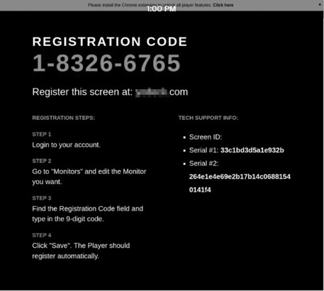

# Zoom Rooms

## Table des matières
- [1. Configuration des Zoom Rooms](#1-configuration-des-zoom-rooms)
  - [1.1. Équipement requis pour les Zoom Rooms](#11-Équipement-requis-pour-les-zoom-rooms)
  - [1.2. Obtention d'une licence Zoom Rooms](#12-obtention-dune-licence-zoom-rooms)
- [2. Création d'une Zoom Room](#2-création-dune-zoom-room)
- [3. Configuration de votre compte Zoom Room avec l'intégration Whitelabel](#3-configuration-de-votre-compte-zoom-room-avec-lintégration-whitelabel)
- [4. Configuration des Zoom Rooms avec un compte Whitelabel](#4-configuration-des-zoom-rooms-avec-un-compte-whitelabel)
- [5. Ajout de contenu à vos écrans](#5-ajout-de-contenu-à-vos-écrans)
- [6. Appareils, applications et contenus pris en charge](#6-appareils-applications-et-contenus-pris-en-charge)

## 1. Configuration des Zoom Rooms
Pour utiliser les Zoom Rooms, vous aurez besoin de deux ensembles de composants matériels.
Tout d'abord, vous aurez besoin d'équipements pour votre salle de réunion, y compris une télévision, un ordinateur macOS ou Windows, et une webcam avec un microphone intégré ou un microphone externe. Alternativement, vous pouvez utiliser un ordinateur macOS ou Windows tout-en-un qui intègre l'écran, l'ordinateur, la webcam et le microphone.
Ensuite, vous aurez besoin d'une tablette pour utiliser l'application de contrôle des Zoom Rooms. Cette tablette peut être un appareil iOS, Android ou Windows. La tablette exécutant l'application Whitelabel Rooms Controller peut être configurée comme un "Contrôleur de salle" pour le contrôle de la salle uniquement ou comme un "Affichage de planification" pour des options de planification complètes. Notez que la fonctionnalité "Affichage de planification" n'est disponible que sur les versions iOS et Android de l'application, pas sur la version Windows.

### 1.1. Équipement requis pour les Zoom Rooms
1.1.1. Comme mentionné précédemment, vous aurez besoin d'une télévision, d'un ordinateur macOS ou Windows, et d'une webcam avec un microphone intégré ou un microphone supplémentaire.
Pour une configuration **macOS**, utilisez un appareil avec un écran intégré, une caméra et des microphones comme un iMac, ou un appareil macOS autonome comme un Mac Mini avec une caméra et un microphone ajoutés (notez que votre appareil macOS doit exécuter OS X Yosemite 10.10.X ou supérieur).
Pour une configuration **Windows**, utilisez un appareil avec un écran intégré, une caméra et un microphone comme un PC tout-en-un, ou un appareil Windows autonome comme un Intel NUC avec une caméra et un microphone ajoutés (notez que votre appareil Windows doit exécuter Windows 10, de préférence la version la plus récente).
1.1.2. Vous aurez également besoin d'une tablette iOS, Android ou Windows pour l'application de contrôle de Zoom, utilisée pour démarrer et arrêter les réunions.
1.1.3. Une licence Zoom Rooms est également requise.

### 1.2. Obtention d'une licence Zoom Rooms
1.2.1. Pour configurer les Zoom Rooms, achetez une licence Zoom Rooms (cliquez ici pour en acheter une) ou inscrivez-vous pour un essai de 30 jours (cliquez ici pour vous inscrire).
1.2.2. Assurez-vous que votre compte dispose des privilèges d'administrateur pour effectuer les étapes suivantes.

## 2. Création d'une Zoom Room
2.1. Connectez-vous à votre compte Zoom Rooms après avoir acquis une licence Zoom Rooms.
2.2. Pour créer une salle, sélectionnez "Gestion des salles" dans la barre latérale gauche, puis choisissez "Zoom Rooms".
2.3. Cliquez sur "Ajouter une salle" pour créer votre salle.
2.4. Nommez votre salle et assurez-vous que le type de salle est défini sur "Zoom Room (pour les espaces partagés)". Vous pouvez également sélectionner un emplacement pour votre salle. Ensuite, cliquez sur "Terminer".

## 3. Configuration de votre compte Zoom Room avec l'intégration Whitelabel
3.1. Retournez à "Gestion des salles" > "Zoom Rooms" dans votre compte Whitelabel Rooms, et cliquez sur "Modifier" à côté du nom de la salle que vous souhaitez utiliser avec la plateforme.
3.2. Choisissez l'onglet "Signalisation numérique".
3.3. Cliquez sur l'un des boutons "Ajouter du contenu".
3.4. Sélectionnez l'option "URL" et collez le lien du lecteur WEB de Whitelabel **(https://player.dsbackend.com)**, puis cliquez sur "Ajouter une URL" et "Ajouter des éléments".
3.5. Pour implémenter les paramètres parfaits pour configurer le lecteur WEB avec Zoom Rooms :
1. Définissez la durée de l'URL que vous venez d'ajouter à 23:59:59.
2. Définissez les minutes de la période d'affichage sous "Commencer à afficher le contenu X min après la fin d'une réunion" à 0 (gardez à l'esprit que vous pourriez vouloir définir cette valeur plus élevée, car si vous avez une réunion programmée et que vous dépassez le temps, cela arrêtera la réunion, donc vous pourriez vouloir définir cette valeur à "10 minutes" pour permettre aux réunions programmées de dépasser un peu le temps si nécessaire).
3. Définissez également les minutes pour "Arrêter d'afficher le contenu X min avant qu'une réunion ne soit programmée pour commencer" à 0.
4. Activez l'option "Signalisation numérique".
5. Enfin, cliquez sur "Enregistrer".
3.6. Votre configuration devrait maintenant ressembler à ceci :
Veuillez noter : Le code affiché dans le navigateur (comme celui ci-dessus) n'est pas le code Whitelabel que vous souhaitez associer. Le code final de l'application Zoom Rooms sur votre ordinateur macOS ou Windows est le code d'association correct à connecter, ce qui est expliqué dans la section suivante.

## 4. Configuration des Zoom Rooms avec un compte Whitelabel
Ensuite, vous devrez installer l'application Zoom Rooms sur votre appareil macOS ou Windows et votre tablette iOS, Android ou Windows.
4.1. Tout d'abord, téléchargez et installez l'application Zoom Rooms sur l'appareil macOS ou Windows que vous utilisez pour votre configuration de salle de réunion. Utilisez le lien de téléchargement approprié en bas de la page de téléchargement de Zoom Rooms.
[https://explore.zoom.usapp.frameup.tech/docs/en-us/zoomrooms/hardware.html](https://explore.zoom.usapp.frameup.tech/docs/en-us/zoomrooms/hardware.html)
4.2. Maintenant, sur votre tablette iOS, Android ou Windows, téléchargez l'application de contrôle Zoom Rooms depuis l'App Store. Les liens vers ces téléchargements se trouvent dans la section "Contrôleurs pour Zoom Rooms" sur la page de téléchargement de Zoom. https://zoom.us/download
Ensuite, connectez-vous à votre compte Zoom Rooms sur votre appareil macOS ou Windows et votre tablette iOS, Android ou Windows et sélectionnez la Zoom Room correcte à utiliser.
Veuillez noter : Si vous êtes jamais demandé votre "Code de salle" pour vous déconnecter ou quitter l'application, rappelez-vous que le code par défaut est **00000** à moins que vous ne l'ayez changé dans votre compte Zoom dans la section Gestion des salles > Zoom Rooms, sous l'onglet "Profil des salles".
4.3. Ouvrez l'application Zoom Rooms sur votre appareil macOS ou Windows et connectez-vous à votre compte Zoom Rooms en utilisant votre email et votre mot de passe ou en utilisant votre compte Google lié à votre compte Zoom.
4.4. Ouvrez l'application de contrôle Zoom Rooms sur votre tablette iOS, Android ou Windows et connectez-vous à votre compte Zoom Rooms. Ensuite, sélectionnez la salle que vous avez configurée précédemment pour une utilisation avec votre compte Whitelabel.
4.5. L'intégration Whitelabel Zoom Rooms devrait démarrer automatiquement et fonctionner comme un économiseur d'écran lorsque votre conférence Zoom Room n'est pas utilisée activement.

## 5. Ajout de contenu à vos écrans
5.1. Une fois que vous avez terminé les étapes précédentes, l'intégration Zoom Rooms se chargera automatiquement sur votre écran Zoom Rooms lorsqu'il n'est pas utilisé pour des réunions vidéo. La première fois que l'intégration Zoom Rooms se charge (ce qui peut prendre jusqu'à 30-60 secondes), vous verrez un code d'association à 9 caractères et des instructions pour ajouter votre écran à votre compte Whitelabel.

## 6. Appareils, applications et contenus pris en charge
Nous recommandons les appareils suivants :
**macOS**
- Mac Mini Fin 2018
- Mac Mini Fin 2014
- Mac Mini Fin 2012
- iMac (Retina 5K, 27 pouces, 2019)
- iMac (Retina 4K, 21,5 pouces, 2019)
- iMac (Retina 5K, 27 pouces, 2017)
- iMac (Retina 4K, 21,5 pouces, 2017)
- iMac (21,5 pouces, 2017)
- iMac (Retina 5K, 27 pouces, Fin 2015)
- iMac (Retina 4K, 21,5 pouces, Fin 2015)
- iMac (21,5 pouces, Fin 2015)
- iMac (Retina 5K, 27 pouces, Mi-2015)
- iMac (Retina 5K, 27 pouces, Fin 2014)
- iMac (21,5 pouces, Mi-2014)
- iMac (27 pouces, Fin 2013)
- iMac (21,5 pouces, Fin 2013)
- iMac (27 pouces, Fin 2012)
- iMac (21,5 pouces, Fin 2012)

**Windows**
- Intel NUC 7 Celeron
- Intel NUC 8 Core i3
- Intel NUC 8 Core i5
- Intel NUC 8 Core i7
- Azulle Byte3
- Azulle Inspire Celeron
- Azulle Inspire Core i3
- Azulle Inspire Core i5
- Azulle Inspire Core i7

